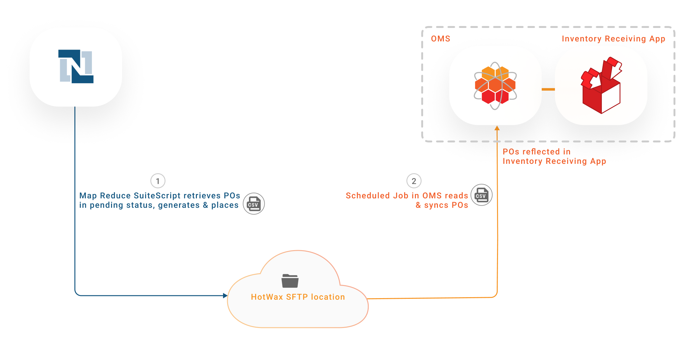
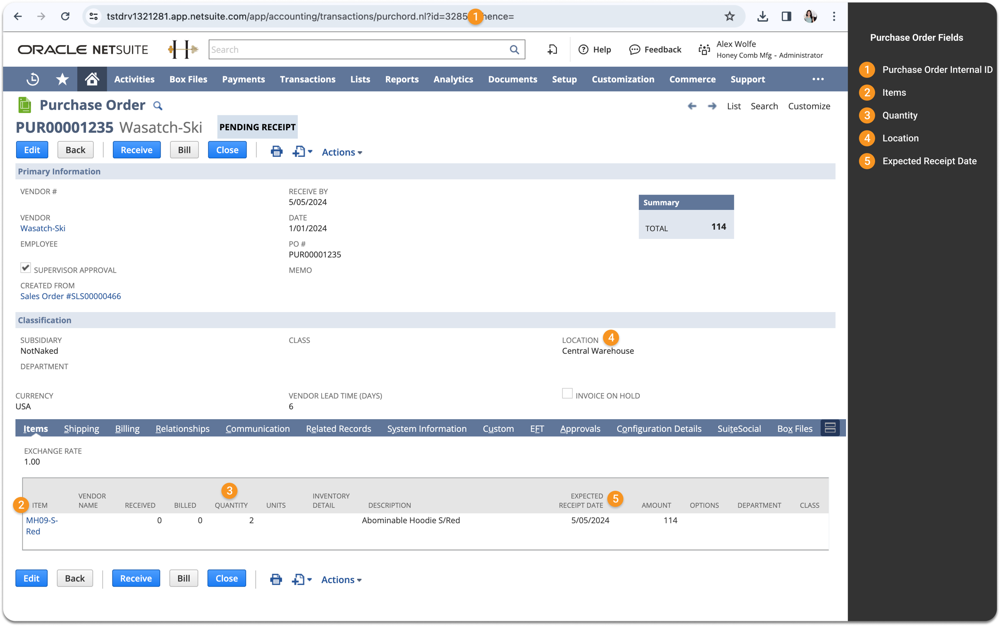
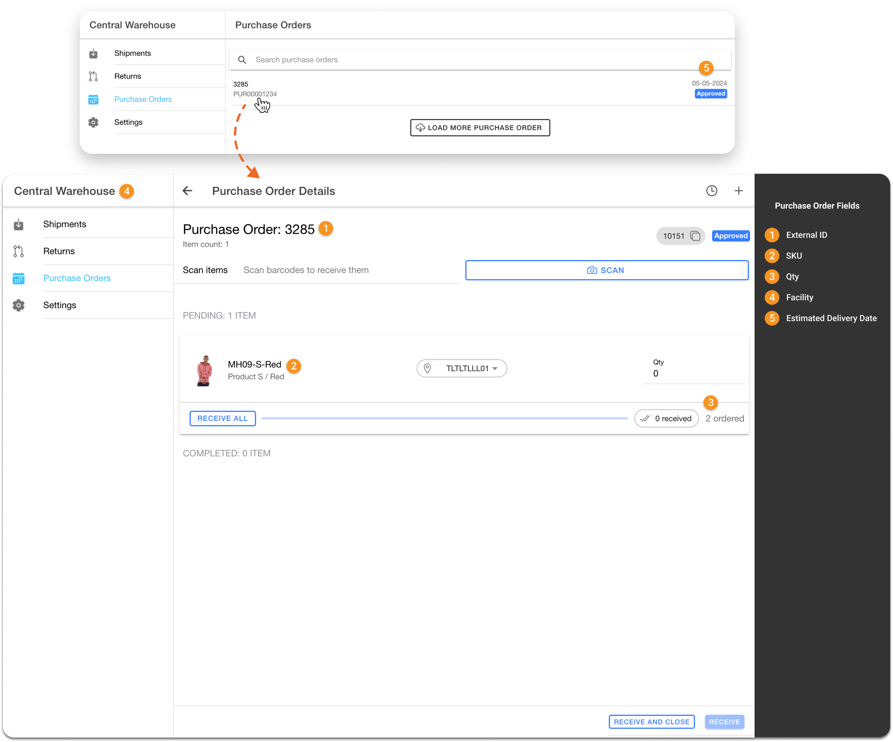
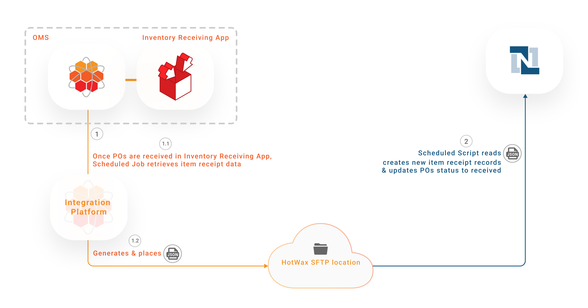

# Purchase Orders

Accurate inventory availability in physical stores is important for omnichannel retail. For retailers using NetSuite as their ERP and HotWax Commerce as their Order Management System, integration is key to synchronizing Purchase Orders (POs) from NetSuite with HotWax Commerce. This synchronization enables store associates to receive and manage inventory using HotWax Commerce's user-friendly in-store inventory management tools.

When a PO is raised in NetSuite, it syncs with HotWax Commerce, allowing store associates to receive inventory through the [Receiving App](https://docs.hotwax.co/documents/store-operations/inventory/receiving) provided by HotWax Commerce.

## Key Objectives

* Automate the synchronization of POs from NetSuite to HotWax Commerce.
* Streamline the creation of Item Receipt records in HotWax Commerce when store associates receive inventory.
* Automate the update of Purchase Order statuses from "Pending" to "Received" in NetSuite once items are received in HotWax Commerce.

## Workflow

### Generate Purchase Orders in NetSuite

The procurement process begins in the NetSuite ERP, where POs are generated to replenish inventory in physical stores.

<figure><figcaption><p>Purchase Order sync from NetSuite to HotWax Commerce</p></figcaption></figure>

### Export Purchase Orders from NetSuite

1. A Map Reduce script initiates the synchronization process by running a Saved Search to identify POs with a "Pending" status in NetSuite. The script compiles the relevant PO data into a CSV file and places it in an SFTP location. This process runs at regular intervals, every 15 minutes, fetching only the latest pending POs. The script is designed to reduce data transfer and processing, maintaining efficient synchronization.

**SuiteScript**

Create a file of open purchase orders

```
HC_MR_ExportedPurchaseOrderCSV
```

**SFTP Locations**

```
/home/{sftp-username}/netsuite/purchaseorder/fulfillment
```

### Import Purchase Orders into HotWax Commerce

2. A scheduled job within HotWax Commerce OMS monitors the SFTP location, periodically checking for new Purchase Order CSV files. The job uses the robust APIs provided by HotWax Commerce's Export/Import tools to import these Purchase Orders.

**Job in HotWax Commerce**

```
Import purchase orders
IMP_ASN_PO_FEED
```

#### Here's how Purchase Order fields are mapped in NetSuite and HotWax Commerce

<table><thead><tr><th width="113">S.No.</th><th width="303.83249581239534">Fields in NetSuite</th><th>Fields in HotWax Commerce</th></tr></thead><tbody><tr><td>1</td><td>Purchase Order Internal ID</td><td>External ID</td></tr><tr><td>2</td><td>Item</td><td>SKU</td></tr><tr><td>3</td><td>Quantity</td><td>Qty</td></tr><tr><td>4</td><td>Location</td><td>Facility</td></tr><tr><td>5</td><td>Expected Receipt Date</td><td>Estimated Delivery Date</td></tr></tbody></table>



<figure><figcaption><p>Purchase Order Fields Mapping in NetSuite</p></figcaption></figure>



<figure><figcaption><p>Purchase Order Fields Mapping in HotWax Commerce "Inventory Receiving App"</p></figcaption></figure>



#### Here's how Purchase Order fields are mapped in NetSuite and HotWax Commerce that remain hidden in the user interface but are included in the Purchase Order CSV file

<table><thead><tr><th width="113">S.No.</th><th width="300.83249581239534">Fields in NetSuite</th><th>Fields in HotWax Commerce</th></tr></thead><tbody><tr><td>1</td><td>Line ID</td><td>Order Item External ID</td></tr></tbody></table>

### Receiving Inventory in the Store

Once POs are synchronized, store associates use the HotWax Commerce's Receiving App to receive new inventory. The app's interface simplifies the receiving process, allowing associates to manage inventory with ease, even with minimal training.

<figure><figcaption><p>Item Receipts Sync from HotWax Commerce to NetSuite</p></figcaption></figure>

After store associates receive POs from app, Item Receipt records are created in HotWax Commerce. These records update inventory counts, making the newly received stock available for sale on eCommerce platforms.

### Export Item Receipts from HotWax Commerce

1. A scheduled job in the HotWax Commerce Integration Platform exports Item Receipt records created in the system back to NetSuite. Each Item Receipt is linked to its corresponding PO, enabling accurate reconciliation and processing. The job runs at defined intervals, based on the retailer's requirements, and compiles Item Receipt data into a JSON file with all relevant details.

Internal location where HotWax places CSV to convert it to NetSuite format.

**SFTP Locations**

```
/home/{sftp-username}/hotwax/PurchaseOrdersReceipt
/home/{sftp-username}/hotwax/PurchaseOrdersReceipt/archive
```

To facilitate the subsequent processing of this data, the JSON file is securely placed in an SFTP location, making it accessible for NetSuite.

**SFTP Locations**

```
/home/{sftp-username}/netsuite/purchaseorder/receipt
```

### Import Item Receipts into NetSuite

2. A scheduled script in NetSuite retrieves JSON files with Item Receipt data from the SFTP location. The script processes each record, creates new Item Receipt records, and updates inventory counts in NetSuite. Since NetSuite's CSV import task does not support Item Receipt records, the N/record module is used to import the data using JSON files.

### Automated Purchase Order Status Update

After Item Receipt records are created, the status of the corresponding POs in NetSuite is automatically updated from "Pending" to "Received." This automated status change enables accurate tracking of received inventory and streamlines purchase order management.

**SuiteScript**

```
HC_SC_ImportPurchaseOrderReceipts
```


The HC\_SC\_ImportPurchaseOrderReceipts SuiteScript also generates a CSV file highlighting erroneous records found during processing and uploads the file to the SFTP server. Simultaneously, an email alert is automatically triggered to designated personnel, helping them quickly pinpoint the source of the issue and accelerating troubleshooting.



