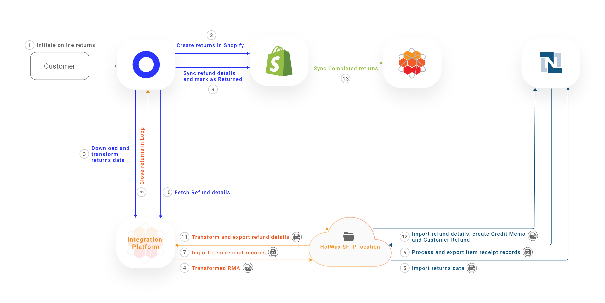
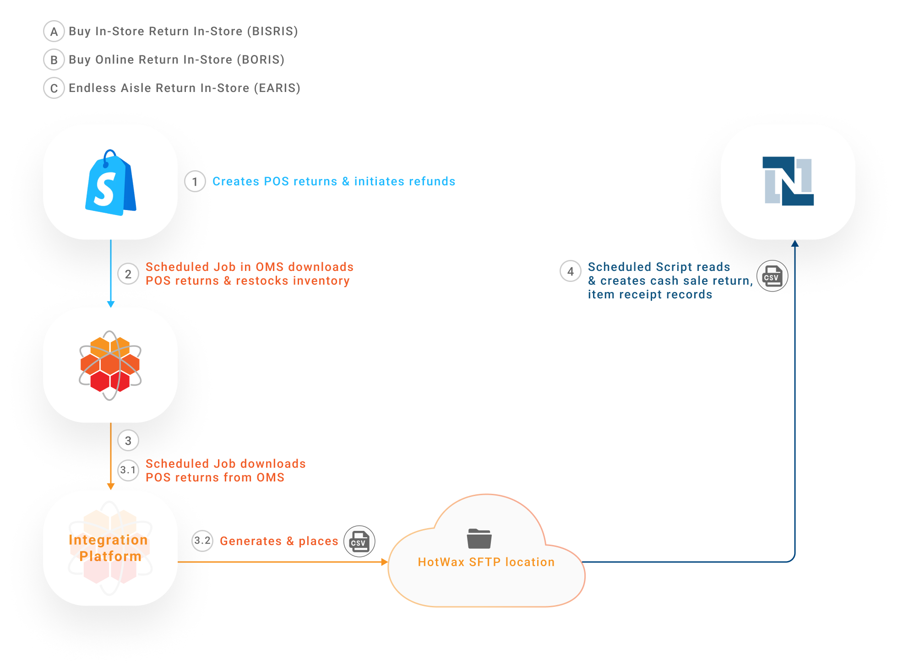

# Returns

## Returns

In omnichannel retailing, retailers provide customers with the options for online returns as well as in-store returns.

## Web Returns with Loop

Customers can initiate online returns for both online and in-store purchases.

### Understanding Different Types of Returns

#### Return as a Refund

A full return or refund refers to the process where a customer returns a product and receives a complete refund of the original purchase price. This is done when the product is returned in its original condition, meeting the retailer’s return policy, and is often credited back to the original payment method used at the time of purchase.

* **Refund on Original Payment Method**: The refund is returned to the same payment method used for the purchase, for example, a credit card refund restores the amount to the card.
* **Refund with a Gift Card (Store Credit)**: The refund is issued as store credit or a gift card, encouraging future purchases.

#### Exchange

An exchange occurs when a customer returns a product and instead of receiving a refund, they swap it for a different item, such as a different size, color, or model. Exchanges are common in cases where the customer prefers an alternative product, and the retailer allows for a direct product swap without returning money.

* **Standard Exchange**: The customer exchanges a product for the same or another item of equal value, with no additional charges or refunds.
* **Higher Value Exchange**: The customer exchanges an item for a higher-priced one, paying the price difference.
* **Lesser Value Exchange**: The customer exchanges an item for a lower-priced one and receives a refund for the price difference.

### Scenarios Where Online Returns Are Accepted

* **Buy Online Return Online (BORO)**: Customers initiate online returns for their eCommerce orders.
* **Buy In-Store Return Online (BISRO)**: Customers initiate online returns for their in-store purchases.
* **Endless Aisle Return Online (EARO)**: Customers initiate online returns for their in-store ordered items which they received home delivery for.

Retailers we work with use Shopify as their eCommerce platform, NetSuite as their ERP system, Loop as their RMS, and HotWax Commerce as their OMS. This returns management workflow involves downloading returns data, creating Return Merchandise Authorizations (RMAs), processing Item Receipt records, and creating Customer Refunds.

<figure><figcaption><p> Sync web returns to NetSuite</p></figcaption></figure>

### Data Flow

#### 1. Initiate Online Returns

Customers go to their online order in Shopify to place a return request. When selecting the return option, they are automatically redirected to Loop’s interface. Once customers submit the return request, Loop fetches the following return details:

* Order ID and items being returned (SKUs and quantities).
* Return reason provided by the customer.
* Any additional details, such as whether the return is for a refund, exchange, or store credit.

Once customers submit return requests, an RMA is created in Loop in the **Open** status.

#### 2. Create Returns in Shopify

Loop automatically syncs newly created returns to Shopify. A return record with the status **Return in Progress** is then added to the original sales order in Shopify. This enables retailers to maintain complete visibility over the entire return lifecycle in their primary sales channel, that is, Shopify.

#### 3. Download and Transform Returns from Loop

HotWax Commerce Integration Platform is subscribed to Loop's webhook to receive return data. When a return is created in Loop, Integration Platform receives an RMA JSON file from Loop.

**How HotWax Commerce Integration Platform Acts as a Bridge**

* **Return details fetched from Loop**: Loop return ID, return total, Shopify order ID, Shopify line item ID.
* **Additional details fetched from HotWax OMS**: HotWax order ID, Shopify order ID, NetSuite order ID, Shopify product SKU.

Using the above details, HotWax Commerce Integration Platform transforms the return data into a format compatible with NetSuite. This transformation is a key feature of HotWax’s integration. By consolidating the original order data with return data, HotWax ensures that RMAs in NetSuite are properly linked to their corresponding sales orders.

**Why does this matter?**

Unlike standard third-party connectors like NovaModule, which merely transfer data between systems, HotWax Commerce’s OMS integrates deeply with Shopify, Loop, and NetSuite. This integration provides the additional order and product details required to establish a direct link between the RMA and the original sales order, something other connectors cannot do effectively.

#### 4. Transform and Export Returns Data from HotWax Integration Platform

Once the RMA data is transformed, a job in HotWax Commerce Integration Platform places the file at a designated SFTP location. This enables NetSuite to access and process the data for creating RMAs for downstream processing.

**SFTP Locations**

```
/home/{sftp-username}netsuite/loop-return/create
```

#### 5. Import Returns Data in NetSuite

Every 15 minutes, a scheduled SuiteScript in NetSuite runs to check for new return files at the SFTP location.

If a new RMA JSON file is found, the NetSuite SuiteScript reads and processes the file. An RMA is then created in NetSuite and marked as **Pending Receipt.**

The newly created RMA is linked to the original sales order. This offers traceability and provides warehouse teams with advance notice that the order item will be returned.

**SuiteScript**

```
HC_SC_CreateLoopReturn.js
```

#### 6. Process and Export Item Receipts Records

When the reAfter a few days, when the customer's returned item is physically received at the warehouse, the following actions take place:

* An Item Receipt record is created and linked to the RMA.
* Inventory is restocked, and the corresponding inventory count is increased in NetSuite.
* The RMA status updates from **Pending Receipt** to **Pending Refund**.

As soon as the Item Receipt record is created in NetSuite, a CSV file is generated containing Loop’s return ID for reference. This file is then placed at the designated SFTP location.

This step is important for completing the return process in Loop, let’s see how in the next steps.

**SuiteScript**

```
HC_SC_CreateLoopReturn.js
```

**SFTP Locations**

```
/home/{sftp-username}netsuite/loop-return/process-return
```

#### 7. Import Item Receipt Records

A job in HotWax Commerce Integration Platform runs every 5 minutes to check for new CSV files received at the SFTP location. If any new files are identified, the job extracts the Loop return IDs from the file and subsequently triggers the \[https://api.loopreturns.com/api/v1/warehouse/return/%7Breturn\_id%7D/process]\(“Process Return” API.)

**SFTP Locations**

```
/home/{sftp-username}/netsuite/loop-return/process-return
```

#### 8. Close Returns in Loop

The Process Return API triggers multiple actions in Loop based on the fetched Loop return IDs:

* The RMA status is updated from **Open** to **Closed**.
* As soon as the RMA in Loop is marked as Closed, multiple actions take place:
  * If the customer selected "Return for Store Credit," Loop automatically issues a gift card to the customer for the corresponding amount.
  * If the customer opted to receive a refund on their original payment method, Loop initiates the refund accordingly.
  * If the customer selected "Exchange," Loop creates a new exchange order in Shopify.

#### 9. Synchronize Refund Details to Shopify

Once the refund is initiated to the customer, Loop syncs the customer refund details to Shopify, updating the return from **In-Progress** to **Returned** in Shopify.

#### 10. Fetch and Transform Refund Details

HotWax Commerce Integration Platform subscribes to the Loop’s webhook to fetch the refund details.

**SFTP Locations**

```
/home/{sftp-username}/netsuite/loop-return/close
```

#### 11. Transform and Export Refund Details

A flow in HotWax Commerce Integration Platform transforms refund data. The JSON file is then placed at the SFTP location.

The file contains details about Loop return ID, Shopify order ID and the refund amount initiated to the customer.

#### 12. Import Refund Details in NetSuite

A SuiteScript in NetSuite imports the file from the SFTP location, processes the data and triggers multiple actions:

* A Credit Memo is created in Open status and linked to the RMA.
* A Customer Refund record is automatically created based on the refund method and linked to the Credit Memo.
* Once the Customer Refund record is created, the Credit Memo is updated from Open to Fully Applied, and the RMA is updated from Pending Refund to Refunded.

**SuiteScript**

```
HC_SC_CreateLoopReturnRefund.js
```

#### 13. Sync Completed Returns from Shopify

A job in HotWax Commerce syncs the newly created Completed returns from Shopify and marks them as Completed in HotWax.

**How is returned inventory restocked in HotWax Commerce?**

Inventory from returns received in the warehouse is synchronized to HotWax Commerce during its periodic inventory sync with NetSuite. HotWax then also syncs the updated inventory counts of the product to Shopify.

Loop also offers the option to restock inventory. However, HotWax recommends disabling this feature in Loop. The reason is that HotWax and NetSuite handle inventory tracking across all locations, while Shopify only maintains a consolidated inventory at its default location.

With this setup, after HotWax restocks the returned inventory from NetSuite during its periodic inventory sync, a corresponding job in HotWax automatically increases the product's inventory count at the default location in Shopify.

***

## POS Returns

Customers who live near a brick-and-mortar store or those who prefer to get instant refunds opt for returning their purchases directly in-store.

**Scenarios where POS returns are accepted:**

* **Buy In-Store Return In-Store (BISRIS):** Customers return their in-store purchases to a nearby store location.
* **Buy Online Return In-Store (BORIS):** Customers directly return their online purchases to a nearby store location.
* **Endless Aisle Return In-Store (EARIS):** Customers return orders made through an endless aisle feature, such as items ordered in-store for home delivery, to a nearby store location.

Retailers we work with, use Shopify POS as their POS system, NetSuite as their ERP system, Loop as their RMS, and HotWax Commerce as their OMS. Some retailers initiate in-store returns using the Loop Returns POS App, while others opt to use their Shopify POS system. Let's explore how these two distinct approaches work:

#### Synchronizing POS Returns to NetSuite when Loop POS is used

Loop Returns POS App provides an intuitive interface to create POS returns.

When it comes to in-store returns, because customers return their order items directly at the store location, the receiving of the order item and the processing of refunds happen simultaneously.

**Create Returns in Shopify and NetSuite**

Once the POS returns are accepted and completed in Loop, it syncs them with both Shopify POS and NetSuite.

Loop creates returns in Shopify POS, marks the order item as returned and payment as refunded. Subsequently, the inventory is restocked against the received order item.

Loop with Novamodule also directly creates a Cash Sale return in NetSuite, marks the order item as returned, payment as refunded and generates item receipt records. Subsequently, the inventory is restocked against the created item receipt.

**Import POS Returns in HotWax Commerce**

A scheduled job in HotWax Commerce downloads these returns from Shopify POS, including the facility ID where the returned items are received. Subsequently, HotWax Commerce marks the item as returned and payment as refunded. If the restocking flag is enabled, HotWax Commerce also restocks the inventory based on the provided facility ID.

As POS returns are already synced to NetSuite by Loop, they are not synced again by HotWax commerce.

<figure><figcaption><p>Sync POS returns to NetSuite using Loop</p></figcaption></figure>

#### Synchronizing POS Returns to NetSuite when Shopify POS is used

Leveraging Shopify POS for in-store returns ensures that store associates are not required to navigate through a separate interface to handle them.

#### Import POS Returns in HotWax Commerce

When POS returns are accepted within the store and completed, a scheduled job in the HotWax Commerce integration platform fetches all returns and exchanges from Shopify and generates a returns and exchanges feed. Another job reads and transforms this feed, sorting returns and exchange orders into different folders on the SFTP server.

Two independent jobs in HotWax Commerce process these orders:

* The `Create Return Order` job downloads the returns from the SFTP path.
* The `Create Exchange Order` job downloads the exchanges.

#### Export POS Returns from HotWax Commerce

A scheduled job in the HotWax Commerce Integration Platform generates a CSV file of POS returns and places this file at an SFTP location.

#### Import POS Returns in NetSuite

A scheduled SuiteScript in NetSuite reads this CSV file from the SFTP location, and generates a Return Merchandise Authorization (RMA) to track the returned items. Following this, a credit memo is generated to record the financial transaction associated with the refund. The credit memo details the total amount to be refunded to the customer.

#### Handling of Multiple Scenarios

When returning an item a customer can also opt to take the exchange item against it. The exchange item may be of higher value than the original item or may be of lesser value. Learn more about how HotWax commerce handles exchanges on an order.

<figure><figcaption><p>Sync POS returns to NetSuite using HotWax Commerce</p></figcaption></figure>
