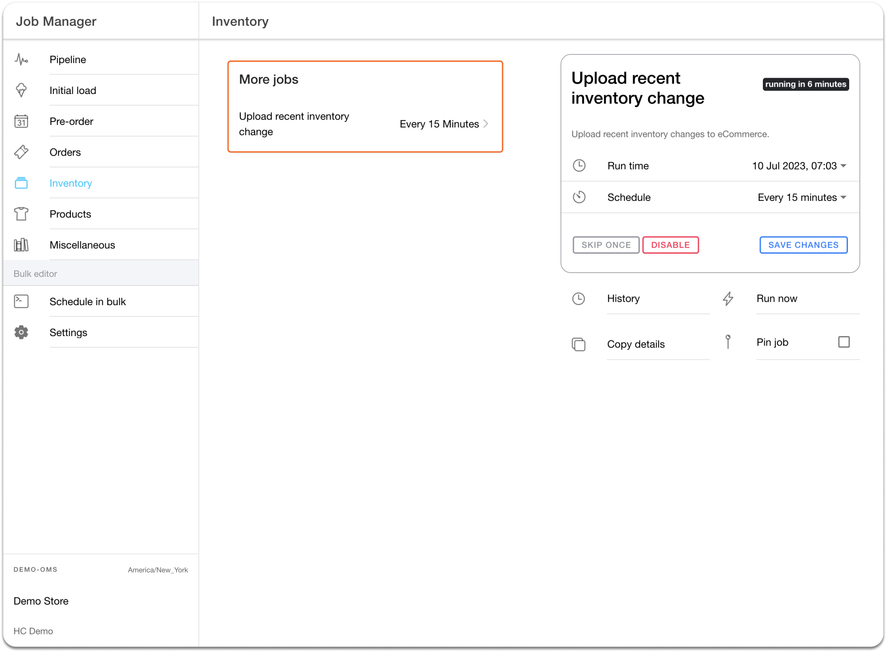
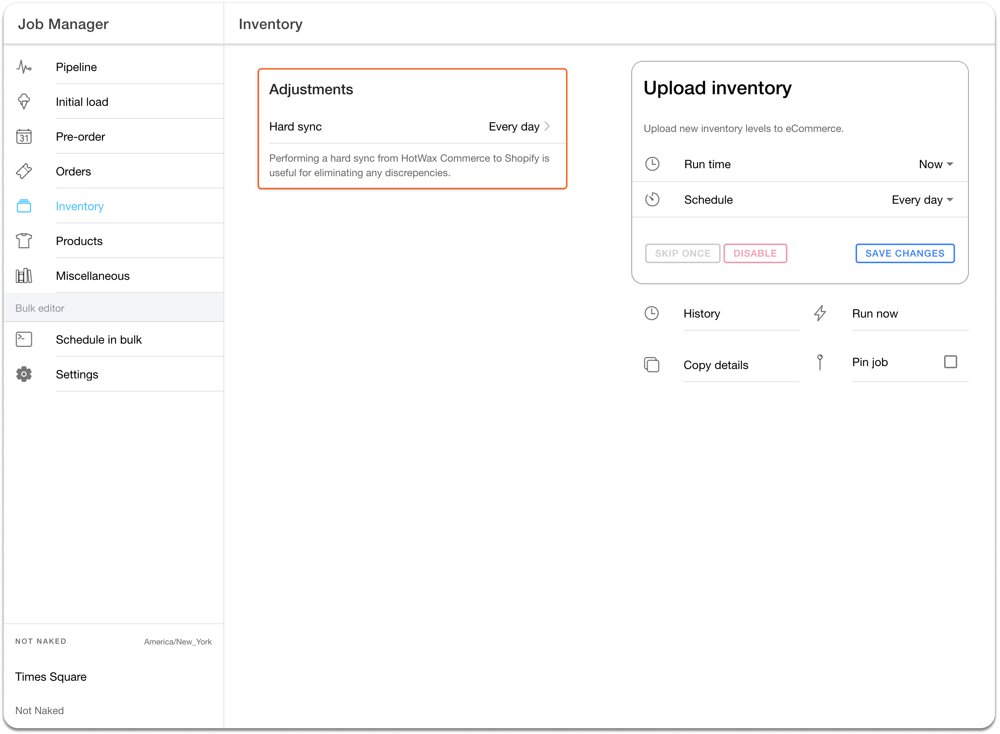

# Inventory Synchronization

**Syncing Inventory From HotWax Commerce To Shopify**

There are two ways to update the inventory count on Shopify: through webhooks or batch jobs.

1. You can keep your inventory data synced in real-time with Shopify's webhooks. By subscribing to the 'inventory level update' webhook, you can trigger synchronization whenever there's an inventory update in HotWax Commerce. Keep in mind that [Shopify can't guarantee webhook delivery](https://shopify.dev/apps/webhooks#limitation), so it's important to periodically reconcile your data with Shopify to ensure everything stays up-to-date.\\
2. HotWax Commerce suggests using batch jobs at regular intervals to sync inventory in bulk, ensuring no product updates are missed. To accomplish this, HotWax Commerce provides the option to schedule the 3 different jobs to offer retailers the flexibility to schedule as per their business requirements.

## Upload Recent Inventory Change

The `Upload Recent Inventory Changes` job updates the inventory on Shopify through the following steps:

* **Identifying Products with Inventory Changes:** The 'Upload recent inventory change' job examines the inventory records of HotWax Commerce's products. It identifies products that have undergone inventory changes since the last synchronization.\
  \
  In the following example, there are five products with inventory records in HotWax Commerce:

<table><thead><tr><th width="163.33333333333331">Product List</th><th>Inventory Count at 1:00 PM</th><th>Inventory Count at 1:15 PM</th></tr></thead><tbody><tr><td>Product A</td><td>100</td><td>95</td></tr><tr><td>Product B</td><td>50</td><td>50</td></tr><tr><td>Product C</td><td>25</td><td>30</td></tr><tr><td>Product D</td><td>100</td><td>100</td></tr><tr><td>Product E</td><td>80</td><td>80</td></tr></tbody></table>

At 1:15 PM, the job that runs every 15 minutes detects that there are inventory changes for Product A and Product C that require syncing with Shopify after the 'Upload recent inventory change' task is executed.

* **Comparing Inventory counts between HotWax Commerce and Shopify:** To update its inventory records, HotWax Commerce initiates an [API call](https://shopify.dev/docs/api/admin-rest/2023-04/resources/inventorylevel#get-inventory-levels?location-ids=655441491) to retrieve information from Shopify about products that have undergone changes in HotWax Commerce. The inventory counts for these products in Shopify are then compared with the inventory counts that HotWax Commerce has on file.

<table><thead><tr><th width="147">Product List</th><th width="238">Inventory Count in Shopify</th><th width="331">Inventory Count in HotWax Commerce</th><th width="198">Inventory Difference</th></tr></thead><tbody><tr><td>Product A</td><td>100</td><td>95</td><td>-5</td></tr><tr><td>Product C</td><td>25</td><td>30</td><td>5</td></tr></tbody></table>

* **Uploading accurate inventory on Shopify:** After comparing inventory changes, the 'Upload recent inventory change' job records the difference and generates a GraphQL file for the affected products. This file is then uploaded to Shopify, which reads it and updates the '[available adjustments](https://shopify.dev/docs/api/admin-rest/2022-10/resources/inventorylevel#post-inventory-levels-adjust)' field to either add or deduct inventory based on the changes.

<table><thead><tr><th width="152">Product List</th><th width="236">Inventory Count in Shopify</th><th width="219">Available Adjustments</th><th width="309">Updated Inventory Count in Shopify</th></tr></thead><tbody><tr><td>Product A</td><td>100</td><td>-5</td><td>95</td></tr><tr><td>Product C</td><td>25</td><td>5</td><td>30</td></tr></tbody></table>

<figure><figcaption>
<em>Fig. 1(i): Sync Inventory for Products with Recent Inventory Changes</em>
</figcaption></figure>

\
When updating inventory on Shopify, HotWax Commerce ensures that the location in Shopify matches the location in HotWax Commerce for merchants. If users utilize a non-Shopify POS, all physical locations in HotWax Commerce will be mapped to one virtual location in Shopify. However, if merchants use Shopify POS and have multiple store locations and an eCom location for online orders, all Shopify locations will be mapped one-to-one with HotWax locations. This means that any inventory updates made to the retail stores and warehouses in HotWax will be reflected in the specific store locations and eCom locations in Shopify for merchants.

## Hard Sync

Sometimes, there may be a slight delay of a few milliseconds between two inventory update jobs from other systems. For instance, if job-1 runs at 1:00:00 PM and job-2 runs at 1:15:00 PM, job-2 checks the inventory changes that happened between 1:00:00 PM and 1:15:00 PM.

However, if a sale occurs in-store at 12:59:59 PM and HotWax Commerce receives an inventory update from the POS at 1:00:01 PM, both jobs won't detect the changes in inventory.

To prevent this issue, merchants can use `Hard Sync` job once a day to synchronize the inventory counts of all products from HotWax Commerce to Shopify. The synchronization is achieved through the GraphQL file, similar to how inventory synchronization is performed for products with recent updates.

<figure><figcaption>
<em>Fig. 2: Hard Sync inventory to remove any discrepancy</em>
</figcaption></figure>

## Push Updated Inventory Deltas to Shopify

The `Push Updated Inventory Deltas to Shopify` job syncs only recent inventory deltas to Shopify. If a product is sold too fast on Shopify and orders are not yet downloaded in HotWax Commerce, then inventory of this product gets out of stock on Shopify, however, inventory in HotWax Commerce is still available. In such cases, the inventory of these products also gets reset with the current ATP in HotWax Commerce with the previous jobs. And due to this Shopify was overselling the inventory.

To improve inventory accuracy, this job only syncs the inventory variances recorded in HotWax commerce rather than resetting the inventory. This means any variance—whether negative (Such as damaged, lost, POS Sales) or positive (TO receiving, Returns restock) are updated to the respective Shopify locations.

For example, Product A has 5 units listed in both Shopify and HotWax Commerce. Shopify then receives 4 orders for this product, which have not yet been downloaded into HotWax Commerce. Meanwhile, one unit of Product A is reported in HotWax Commerce as damaged or missing, reducing the online ATP in HotWax Commerce to 4. In this scenario, HotWax Commerce will now push a -1 inventory variance to Shopify instead of resetting the inventory to 4. The ATP on Shopify will be adjusted to 0, ensuring the product is marked as `Out of Stock` in Shopify, as Shopify has already received orders for 4 units.

In another example, if a store receives a transfer order for Product B with 2 units, which originally had 10 units, then a variance of 2 will be pushed on Shopify to update the Shopify ATP to 12. 

