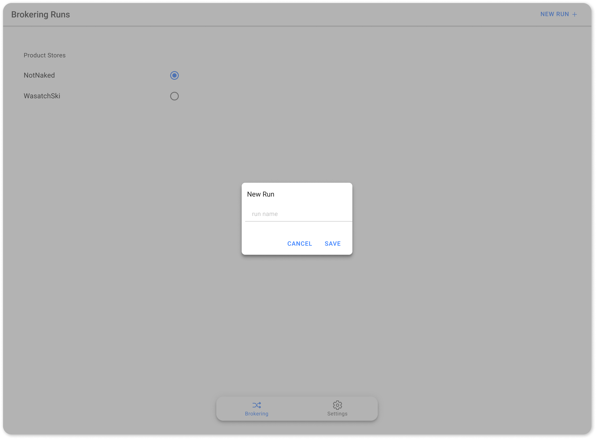
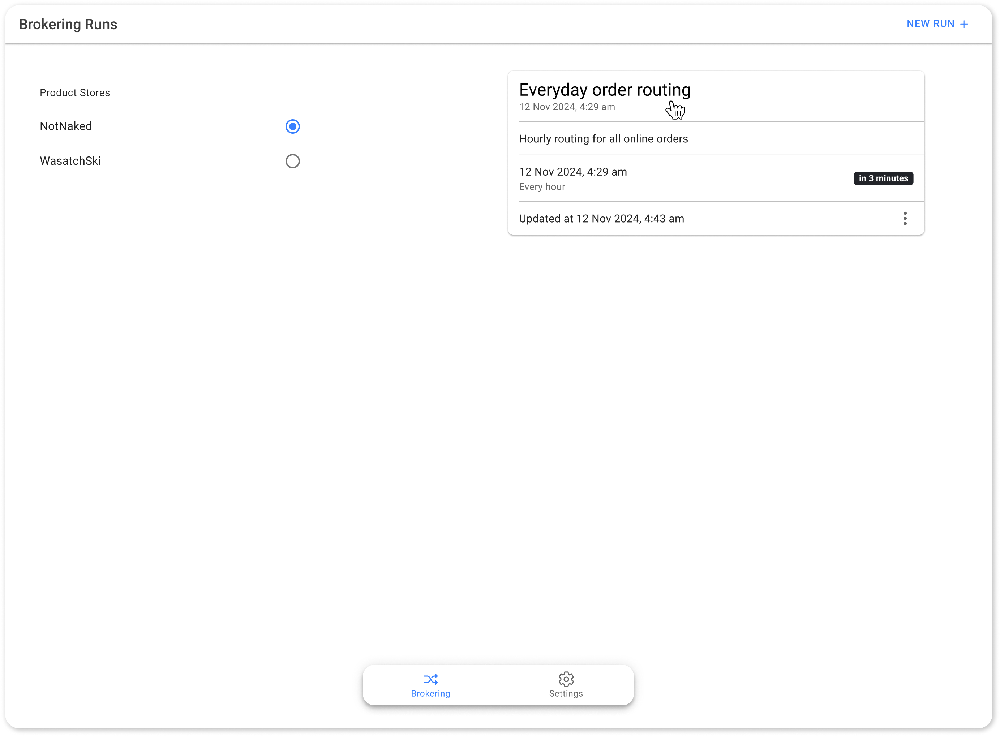
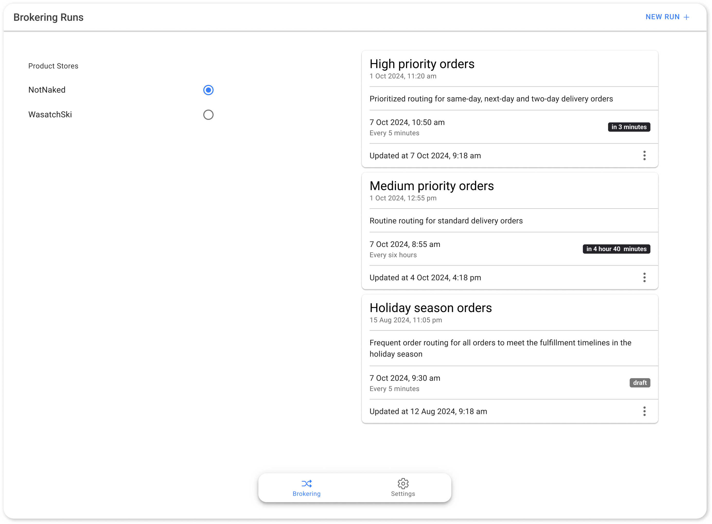
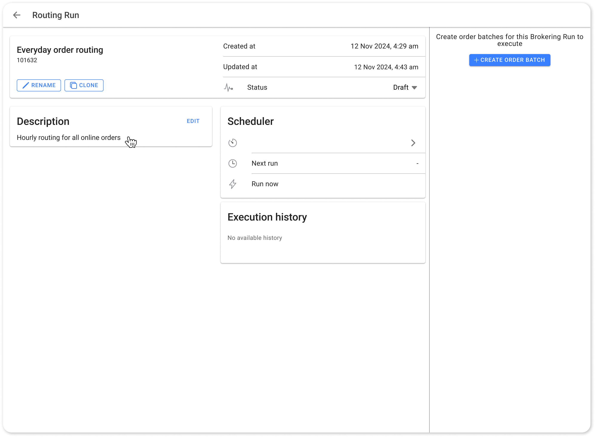
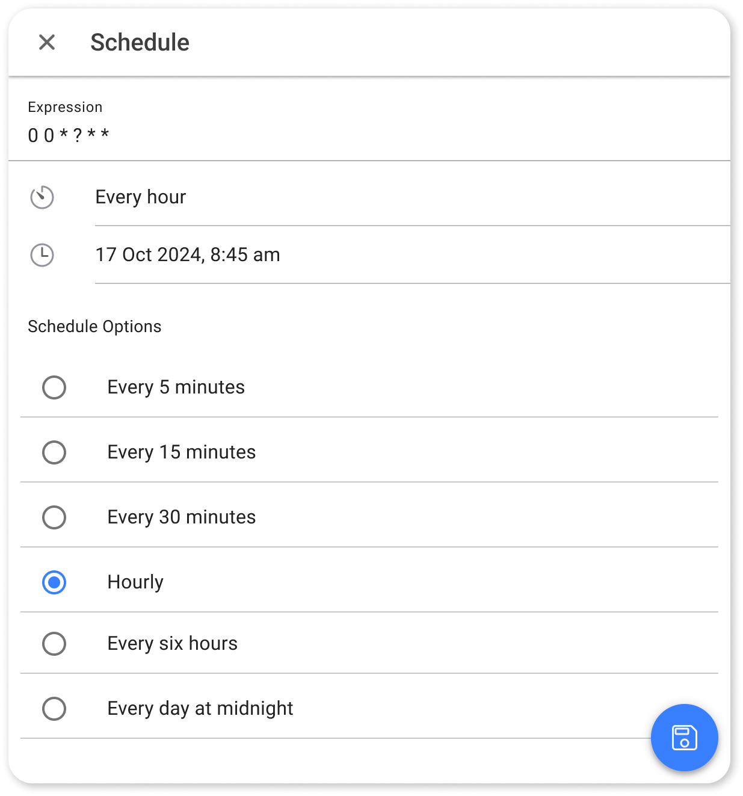

# Brokering Runs

As discussed, <mark style="color:orange;">**brokering runs**</mark> serve as the highest level of organization in order routing, defining when and how frequently order routing takes place. Each brokering run has a specific _frequency_, such as every 5 minutes, hourly, daily, or at custom intervals based on business needs.

### Why Use Multiple Brokering Runs?

Multiple brokering runs allow retailers to set different frequencies for each batch of orders. For example, high-priority orders can be routed more frequently (every 5 minutes), so urgent orders receive immediate attention, while standard or less time-sensitive orders are routed at more moderate intervals (hourly).

### Single vs. Multiple Brokering Runs

* **Single run setup:** For retailers with similar urgency across orders and a lower order volume, a single run at regular intervals (every hour) can manage all order types in one brokering cycle.
  * Everyday order routing: Within this single brokering run, multiple routing rules (order batches) can be created to address different delivery needs, such as same-day delivery orders, two-day delivery orders and standard delivery orders. We’ll understand in depth about [routing rules](routings.md) in the next sections.
* **Multiple runs for different priorities:** In the event where order fulfillment priorities vary significantly and the order volume is high, creating separate runs can optimize resources and allocation:
  * High-Priority Orders: For orders requiring same-day, next-day, or two-day delivery, setting a frequency of the brokering run to every 5 minutes can quickly allocate inventory to this order batch and meet urgent fulfillment deadlines.
  * Medium-Priority Orders: For orders on standard deliveries, a separate brokering run with a 6-hour interval can balance routine order routing with the available resources.
* **Seasonal run adjustments:** During peak seasons, like holidays, retailers can activate a dedicated high-frequency brokering run to handle increased order volumes. For example, a run set to every 5 minutes for all orders that can remain in draft mode on regular days but be activated to handle seasonal surges.

The frequency and configuration of each run are critical for optimizing brokering strategies, allowing retailers to meet diverse order priorities effectively.

## Creating and Managing Brokering Runs

Now, let’s understand how you can achieve your order routing and fulfillment goals with the HotWax Commerce’s `Order Routing App`:

#### <mark style="color:orange;">Steps to create a new brokering run</mark>

1. **Open the** `Order Routing App`
   * Start by opening the `Order Routing App`. This will take you to the home page, where you can view all previously created brokering runs. If no brokering runs have been created yet, the page will appear blank.


If you have multiple product stores, you’ll be prompted to choose the store for which you want to create a brokering run. This feature helps in managing order routing uniquely for each store. Learn more about [product stores](https://docs.hotwax.co/documents/system-admins/product-store/add-more-product-stores).


2. **Initiate a new run**
   * Click on the `New Run` button to begin creating a new brokering run. You’ll be prompted to provide a name for this run, which will help identify it in the list of all existing brokering runs.

<figure><figcaption>
Initiate a New Run
</figcaption></figure>

3. **Name the run**

* Give the run a meaningful name that reflects its purpose. For example, if you’re creating a single brokering run for all orders you can name it <mark style="color:orange;">**“Everyday order routing”**</mark> or if you are creating multiple brokering runs based on the order urgency, you can name them as <mark style="color:orange;">**“High priority orders”**</mark> with the next run as <mark style="color:orange;">**“Medium priority orders”.**</mark>



<figure><figcaption>
Single Brokering Run
</figcaption></figure>



<figure><figcaption>
Mutiple Brokering Runs
</figcaption></figure>



4. **Add a description**
   * After naming the run, we need to add a description to provide further context. Descriptions help in clarifying the intent behind each brokering run, making it easier for team members to understand its specific function.
   * Click on a specific `Run` to open its details and now navigate to the Description card and add details that best describes your run.
   * For example, if there is a single brokering run "Everyday order routing", you can write: “Hourly routing for all online orders” or if the run focuses on urgent orders, you can write: “Prioritized routing for same-day, next-day, and two-day delivery orders.”

<figure><figcaption>
Brokering Run Description
</figcaption></figure>

5. **Schedule the brokering run with a predefined frequency or using cron expressions**

<figure><figcaption>
Schedule Brokering Run
</figcaption></figure>

* Navigate to the Scheduler card, here you can set the frequency and runtime for your brokering run.
* You can choose predefined intervals or use cron expressions to customize the schedule based on your business needs. Here are a few examples of valid cron expressions that you can use:

<table><thead><tr><th width="231">Schedule Description</th><th width="207">Cron Expression</th><th>Explanation</th></tr></thead><tbody><tr><td>Run Every 5 Minutes</td><td><code>*/5 * * * *</code></td><td>Triggers the brokering run every 5 minutes throughout the day.</td></tr><tr><td>Run Every Hour</td><td><code>0 * * * *</code></td><td>Triggers the brokering run every hour throughout the day.</td></tr><tr><td>Run Every Hour Between 8 AM and 2 PM</td><td><code>0 8-14 * * *</code></td><td>Triggers the brokering run at the top of every hour, between 8 AM and 2 PM.</td></tr><tr><td>Run Every Day at 7 AM</td><td><code>0 7 * * *</code></td><td>Triggers the brokering run every day at 7 AM.</td></tr><tr><td>Run Every 15 Minutes Between 6 AM and 6 PM</td><td><code>*/15 6-18 * * *</code></td><td>Triggers the brokering run every 15 minutes from 6 AM to 6 PM.</td></tr></tbody></table>

* For our <mark style="color:orange;">**Everyday order routing**</mark> brokering run we can directly choose the predefined "_Hourly_" frequency and save it.


You need to change the brokering run's status from **Draft** to **Active** to make it operational. 

By default, new brokering runs are set to **Draft**. Simply select **Active** from the dropdown to activate it, or revert an active run back to **Draft** if adjustments are needed.

Ideally, activate the brokering run only once you've fully configured your routing, inventory rules, and other settings.


Understanding how to view, schedule, and manage brokering runs is important for optimizing your order routing strategies.

Now, let's understand about [routings](routings.md) within a brokering run.
