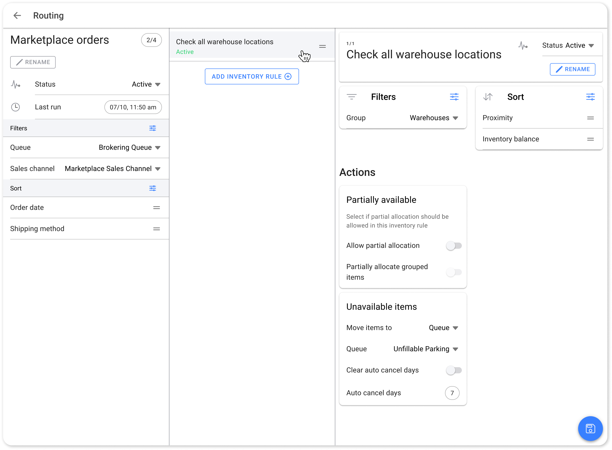
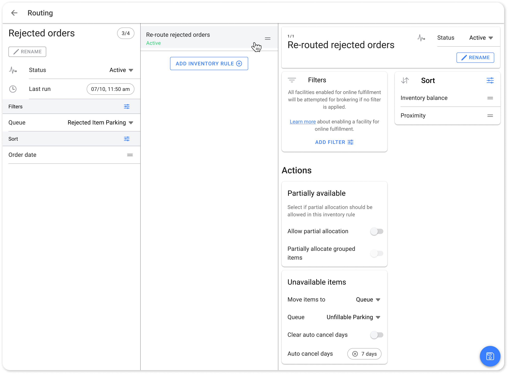
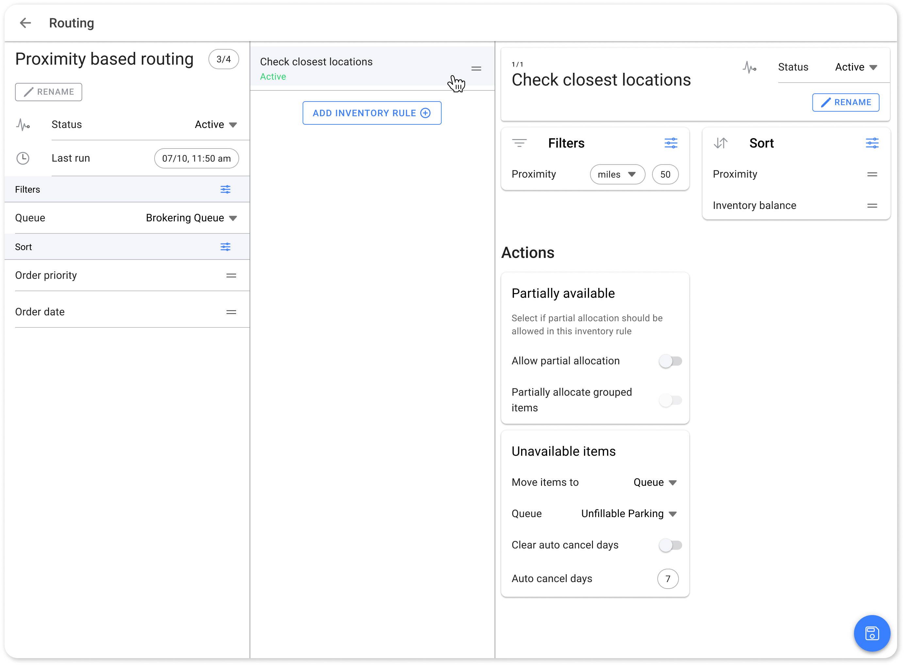

# Use Cases

## Scenario 1: Fulfilling Marketplace Orders from Warehouse

A retailer wants to ensure that all orders placed through various marketplaces are fulfilled exclusively from their warehouse. This scenario is common for businesses that prefer to manage marketplace orders separately due to specific logistical or contractual obligations.

### Pre-Requisites for This Scenario

* **Marketplace\_sales\_channel** must be created in HotWax Commerce and mapped with the relevant [sales channels in Shopify](https://docs.hotwax.co/documents/learn-shopify/setup-shopify/integration-mapping/sales-channel-mapping).
* A [facility group must be created](https://docs.hotwax.co/documents/system-admins/administration/facilities/manage-groups) in HotWax Commerce with the **Brokering\_group** subtype, which includes all warehouse locations.

### Steps to Implement

#### Create Run

To create a new brokering run for marketplace orders, begin by opening the Order Routing App. If you are managing multiple product stores, select the relevant store to ensure marketplace orders are routed correctly. Next, click on New Run and name the run something clear and specific, such as “Marketplace Order Routing,” to easily identify its purpose. Add a description like “Routing all marketplace orders through warehouse locations only” to provide clarity for your team. Finally, navigate to the Scheduler card and set the appropriate frequency for this routing run, ensuring marketplace orders are processed on time.

#### Create Routing Rules

To set up routing rules for marketplace orders, first, select the previously created routing run for marketplace orders in the Order Routing App. This ensures the routing rule is linked to the correct run.

In the next step, apply the necessary configurations:

* **Add Order Filter:** Use the Sales Channel filter to include only marketplace orders, ensuring orders from Shopify or other marketplaces are grouped and brokered separately from other channels.
* **Sort Orders:** Set the sorting criteria to Order Date. This ensures that older marketplace orders are prioritized for inventory allocation, following a first-in, first-out (FIFO) approach.

#### Create Inventory Rule

To create inventory rules for marketplace orders, first ensure that the appropriate routing rule for marketplace orders is selected, then click on Add Inventory Rule. Once the inventory rule is created, follow these steps:

* **Add Inventory Filter:** Apply the Facility Group filter and select the group for warehouses only. This ensures that the inventory from warehouse locations is considered for the routing.
* **Sort Inventory:** Sort the inventory by proximity to the customer’s delivery address. This helps minimize shipping costs by prioritizing inventory that is closer to the destination.
* **Define Actions:** If inventory is unavailable, toggle on Partial Fulfillment to allow order splitting. For completely unavailable inventory, select Send Orders to Queue and assign them to the `Unfillable Queue` for further processing.

<figure><figcaption>
Marketplace Orders Routing
</figcaption></figure>

## Scenario 2: Fulfilling eCommerce Orders from Warehouse and Stores

Retailers often prefer to fulfill eCommerce orders from their warehouse first, but when inventory is unavailable, the orders should be routed to retail stores for fulfillment. This helps ensure that orders are not delayed and inventory is optimized across all available locations.

### Pre-Requisites for This Scenario:

To implement this scenario, you need two key facility groups in HotWax Commerce. First, create a **Warehouses** facility group under the Brokering\_Group subtype, which will include all your warehouse locations. Second, create a **Stores** facility group, also under the Brokering\_Group subtype, to ensure that all retail store locations are available for routing when necessary. These facility groups ensure clear separation of inventory between warehouses and retail stores.

### Steps to Implement

#### Create Run

To create a new brokering run for eCommerce orders, open the `Order Routing App`. If your system manages multiple product stores, be sure to select the relevant store to ensure the correct routing. Click on `New Run`, and give it a clear name such as "eCommerce Order Routing." This naming convention will help easily identify the run for future use. In the description field, add something like "Prioritizing warehouse fulfillment, with store fallback" to clarify the purpose of the run for the rest of your team. Finally, navigate to the `Scheduler card` to set the run's frequency. This ensures that eCommerce orders are processed in a timely manner.

#### Create Routing Rules

To configure the routing rules for eCommerce orders, first, ensure that the **eCommerce Order Routing** run is selected.

* **Add Order Filter**: Use the `Sales Channel filter` to select only eCommerce orders. This will group and broker orders specifically from your eCommerce channel, keeping them separate from orders placed through other sales channels.
* **Sort Orders**: Set the sorting criteria to `Order Date`. This ensures that older orders are processed first, following a first-in, first-out (FIFO) model for order fulfillment.

#### Create Inventory Rules

Now, create inventory rules to route orders through the appropriate facilities. First, make sure that the correct **eCommerce Order Routing** rule is selected, then click on `Add Inventory Rule`.

* **First Inventory Rule (Warehouses)**\
  The first rule ensures that orders are fulfilled from warehouse locations:
  * **Add Inventory Filter**: Apply the `Facility Group filter` and select the group for **Warehouses** only, ensuring that orders are initially routed through the warehouse locations for fulfillment.
  * **Sort Inventory**: Sort by `proximity` to the customer’s delivery address to help minimize shipping costs, prioritizing fulfillment from warehouses closest to the destination.
  * **Define Actions**: If inventory is unavailable at the warehouses, set the rule to send the order to the next inventory rule, allowing the system to route the order to available retail stores. If you want to allocate partially available inventory from the warehouse to the orders, turn on the toggle for Prtial Fulfillment.
* **Second Inventory Rule (Stores)**\
  The second rule is triggered when the warehouse is unable to fulfill the order:
  * **Add Inventory Filter**: Apply the `Facility Group filter` and select the group for **Stores**, allowing the system to route orders through retail store locations as a secondary option.
  * **Sort Inventory**: Sort by `proximity` to the customer’s delivery address, helping to minimize shipping costs by routing orders to the nearest store.
  * **Define Actions**: If the inventory is also unavailable in the stores, send the order to the `Unfillable Queue` for further processing, ensuring that orders that cannot be fulfilled are properly handled. Allow partial fulfillment by turning on the toggle to allow order splitting and ensure available items are fulfilled.

#### Activate and Schedule

Once the routing rules and inventory rules are set up, the next step is to activate the rules and schedule the run. First, change the status of the **eCommerce Order Routing** run from `Draft` to `Active`. This makes the run ready for live processing. After that, activate the inventory rules for both warehouses and stores, ensuring they are applied during the routing process. Finally, schedule the routing run by setting the frequency at which it should occur, ensuring that eCommerce orders are brokered and fulfilled without delays.


eCommerce Orders Routing


## Scenario 3: Re-Routing Rejected Orders

When orders is rejected from stores due to inventory unavailability, the order routing engine automatically re-routes the rejected orders to the next best location with available inventory. This ensures fulfillment while minimizing cancellations, and improving operational efficiency and customer satisfaction.

### Steps to Implement

#### Create Run

Start by creating a new brokering run for rejected orders in the `Order Routing App`. Click on `New Run` and name it something clear, such as “Rejected Orders Re-Routing.” Add a description like "Re-routing rejected orders to available locations" for better team understanding. Finally, navigate to the `Scheduler card` to set the frequency for this routing run, ensuring that rejected orders are handled in a timely manner.

#### Create Routing Rules

Once the run is created, set up the routing rules for re-routing rejected orders.

* **Add Queue Filter**: Apply the `Queue Filter` in the order batch settings and select the `Rejected Order Item` queue. This ensures that only rejected orders are included in this batch.
* **Sort Orders**: Set the sorting criteria to `Order Date`, ensuring that the oldest rejected orders are reprocessed first, following a first-in, first-out (FIFO) method.

#### Create Inventory Rule

Now, create an inventory rule that routes orders to the best available location.

* **Add Inventory Filter**: If you are checking the inventory at all locations, without any additional filters, you don't have to add inventory rule here.
* **Sort Inventory**: Sort by `proximity` to the customer’s delivery address to minimize shipping costs.
* **Define Actions**: If inventory is unavailable across all locations, select one of the following options:
  * If you want to split the order to allocate the inventory for the items available, turn on the toggle for partial rejection.
  * If you have another inventory rule for further allocation, select send to `Next Rule` to attempt routing based on the next rule.
  * If no further rules exist, select send to `Unfillable Queue` to handle orders manually or through alternative processes.

#### Activate and Schedule

Once the routing and inventory rules are configured, activate the **Rejected Orders Re-Routing** run by changing its status from `Draft` to `Active`. Then, schedule the routing runs to ensure timely re-routing of rejected orders at regular intervals.

<figure><figcaption>
Rerouting Rejected Orders
</figcaption></figure>

## Scenario 4: Proximity-Based Order Routing

Retailers may want to fulfill orders from locations closest to the customer to minimize delivery times and costs. By applying a proximity-based routing strategy, businesses can improve both operational efficiency and customer satisfaction.

### Steps to Implement

#### Create Run

To start, open the `Order Routing App` and create a new brokering run for proximity-based routing. Name the run something descriptive, such as "Proximity Order Routing." In the `Scheduler card`, set the appropriate frequency for the run to ensure timely processing of orders based on proximity.

#### Create Routing Rules

Once the run is created, define the routing rules to prioritize fulfillment based on customer proximity.

* **Add Order Filter**: Apply the `Queue Filter` to select the `Brokering Queue`. By default, orders from all queues will be included. If you need to focus on a specific queue, select accordingly.
* **Sort Orders**: Sort the orders by `Order Date`. This ensures that older orders are given priority in the routing process, following a first-in, first-out (FIFO) approach.

#### Create Inventory Rule

Now, configure the inventory rule to allocate stock based on proximity.

* **Add Inventory Filter**: Apply the `Proximity Filter` with a specified distance (e.g., 50 miles). This ensures that orders are routed to locations within the defined proximity of the customer’s delivery address.
* **Sort Inventory**: Sort the inventory by `Proximity`. This ensures that the nearest fulfillment locations are prioritized for order allocation.
* **Define Actions**: Define actions if the inventory is not found for the order in this inventory rule.
  * **Allow Partial Fulfillment**- If you want to split the order to allocate the inventory within 50 miles for the items available, turn on the toggle for partial rejection.
  * **Send to Next Rule**: If you want to broaden the search beyond 50 miles, select the option to send the order to the next inventory rule.
  * **Send to Unfillable Queue**: If you want to limit fulfillment to locations within 50 miles and no inventory is available, send the order to the `Unfillable Queue` for further action.

#### Activate and Schedule

Once the rules are set up, activate the proximity-based rules and routing run by changing the status from `Draft` to `Active`. Then, schedule the routing run at regular intervals to ensure efficient processing of orders based on proximity.

<figure><figcaption>
Proximity Based Routing
</figcaption></figure>

## Scenario 5: Minimum Stock Availability

Retailers need to balance in-store inventory for walk-in customers while fulfilling online orders. To do this, they want to allocate online orders only to locations with sufficient stock, ensuring that in-store inventory is preserved. Using the `Brokering Safety Stock` feature allows retailers to set a minimum stock threshold for order allocation, protecting essential inventory for physical store customers.

### Steps to Implement

#### Create Run

Open the `Order Routing App` to begin creating a new brokering run. Name the run something like "Minimum Stock Order Routing" for clarity, and provide a description such as "Allocating online orders only to locations meeting minimum stock levels." Then, in the `Scheduler card`, set the appropriate frequency for the routing run to ensure the timely processing of orders.

#### Create Routing Rules

Define the routing rules to ensure online orders are routed only to locations that meet the minimum stock levels for each item.

* **Add Order Filter**: Apply the `Brokering Queue` filter to route orders from the appropriate queue.
* **Sort Orders**: Sort orders by `Order Date` to prioritize older orders in the routing process, ensuring a first-in, first-out (FIFO) approach.

#### Create Inventory Rules

Set up inventory rules that ensure fulfillment is done only from locations that meet the required stock levels.

* **First Inventory Rule**:
  * **Add Inventory Filter**: Apply the `Brokering Safety Stock` filter and define the minimum stock level required for inventory allocation. For example, if the `Brokering Safety Stock` is set to greater than 10, the inventory will only be allocated if the store has more than 10 units of that item available. This ensures that walk-in customers have access to sufficient stock._
  * **Sort Inventory**: Sort the inventory by `Inventory Balance` to prioritize locations with higher stock levels.
  * **Action**: If no location can fulfill the entire order based on the first rule, select the option to `Send to Next Rule`.
* **Second Inventory Rule**:
  * **Add Inventory Filter**: No specific filter is selected, as inventory can be allocated from any available location.
  * **Sort Inventory**: Sort the inventory by `Inventory Balance` to prioritize locations with the most available stock.
  * **Action**: If partial fulfillment is allowed, enable `Allow Partial Fulfillment` to split the order between multiple locations. If partial allocation is not an option, select `Send to Unfillable Queue`.

#### Activation and Scheduling

Activate both inventory rules and the order routing batch. Ensure that the rules are in effect by changing the status of the batch from `Draft` to `Active`. Lastly, schedule the routing runs to occur at regular intervals, ensuring efficient and timely fulfillment of online orders while maintaining adequate stock levels for in-store customers.


Set Brokering Safety Stock


## Scenario 6: Managing Store Fulfillment Based on Rent Agreements

Retailers who manage stores with varying rent agreements, especially those in malls where rent is tied to sales revenue, need to optimize order fulfillment to avoid high rental costs. By prioritizing stores with fixed or lower rent costs for order fulfillment, retailers can increase profitability while still ensuring order fulfillment.

### Prerequisites for This Scenario

* **Facility Group Setup**: Ensure that facility groups are already created for stores with fixed rental agreements.
  * **Fixed Rent Stores**: Group stores with fixed or lower rent costs.
  * **All Stores**: Group all stores to use as a fallback for order fulfillment when necessary.

### Steps to Implement

#### Create Run

Open the `Order Routing App` and set up a new brokering run. Name the run something like "Fixed Rent Store Fulfillment" to indicate that this run prioritizes stores with fixed or lower rent costs. In the `Scheduler card`, set the appropriate frequency for routing to ensure orders are processed at regular intervals.

#### Create Routing Rules

Define routing rules to prioritize cost-effective fulfillment locations.

* **Add Order Filter**: Apply the `Brokering Queue` filter to route orders from the appropriate queue.
* **Sort Orders**: Sort orders by `Order Date` to prioritize older orders in the routing process.

#### Create Inventory Rules

Set up inventory rules to ensure fulfillment is prioritized based on store rent agreements.

* **First Inventory Rule**:
  * **Add Inventory Filter**: Select the facility group created for stores with fixed or lower rent costs.
  * **Sort Inventory**: Sort inventory by `Inventory Balance` to prioritize locations with sufficient stock levels in these low-rent stores.
  * **Action**: If no location can fulfill the order based on this rule, select the option to `Send to Next Rule`.
* **Second Inventory Rule**:
  * **Add Inventory Filter**: Select the facility group that includes all stores to broaden the search to any available location.
  * **Sort Inventory**: Sort inventory by `Inventory Balance` to prioritize locations with the most available stock.
  * **Action**: If partial fulfillment is allowed, enable `Allow Partial Fulfillment` to split the order between multiple locations. If partial allocation is not an option, select `Send to Unfillable Queue`.

#### Activation and Scheduling

Activate both inventory rules and the order routing batch. Ensure that the rules are active and schedule the brokering runs to execute at regular intervals, ensuring efficient and cost-effective fulfillment of online orders while managing rental costs.


Store Fulfillment Based on Store Rent


## Scenario 7: Balancing Shipping Costs and Distance with Split Shipments

Retailers need to balance the cost of shipping, which is influenced by both the distance and the number of shipments. The goal is to minimize shipping costs by considering when it's more cost-effective to ship from multiple locations versus a single distant location. This scenario is particularly relevant for retailers with stores and warehouses spread across a wide geographic area.

### Steps to Implement

#### Create Run
Open the `Order Routing App` and create a new brokering run. Name it "Proximity and Cost-Based Shipping" to reflect that the routing will balance shipping costs with distance and split shipments when necessary. Set up a regular schedule for the run to ensure continuous order processing.

#### Create Routing Rules
Define routing rules to balance shipping costs and minimize the distance of fulfillment.

- **Add Order Filter**: Apply the `Brokering Queue` filter to ensure that orders from the correct queue are routed.
- **Sort Orders**: Sort orders by `Order Date` to ensure older orders are fulfilled first.

#### Create Inventory Rules
Define a series of four inventory rules to balance shipping costs with proximity and partial allocation options.

- **First Inventory Rule**:  
  - **Add Inventory Filter**: Apply a `Proximity Filter` to limit the search to locations within 100 miles.
  - **Sort Inventory**: Sort the inventory based on `Proximity` to prioritize the nearest locations.
  - **Action**: Disable partial allocation to ensure that the entire order is fulfilled from a single location within 100 miles. If no location can fulfill the order, send to the next rule.

- **Second Inventory Rule**:  
  - **Add Inventory Filter**: Apply the same `Proximity Filter` of 100 miles.
  - **Sort Inventory**: Sort the inventory based on `Proximity`.
  - **Action**: Enable partial allocation to allow the order to be split across multiple locations within the 100-mile proximity. If the order cannot be fully allocated, send to the next rule.

- **Third Inventory Rule**:  
  - **Remove Proximity Filter**: This rule expands the search to distant locations without any proximity constraints.
  - **Sort Inventory**: Sort the inventory based on `Proximity`.
  - **Action**: Disable partial allocation to require the entire order to be fulfilled from a single, distant location. If no single distant location can fulfill the order, send to the next rule.

- **Fourth Inventory Rule**:  
  - **No Inventory Filter**: Allow all available locations to be included.
  - **Sort Inventory**: Sort the inventory based on `Proximity`.
  - **Action**: Enable partial allocation to allow the order to be split across all available locations. If the order still cannot be fulfilled, send to the unfillable queue.

#### Activation and Scheduling
Activate all inventory rules and ensure that the order routing batch is active. Schedule the brokering runs to execute at regular intervals, ensuring a balance between shipping cost and distance while also handling split shipments when required.


Balance Shipping Cost and Distance with Split Shipments


## Scenario 8: Managing Order Splitting for Grouped Items (Kits and Gift Items)

Retailers often face scenarios where certain items in an order must be shipped together, while other items can be shipped separately. For example, if a customer orders a frame and lenses along with sunglasses, the frame and lenses must be shipped together, but the sunglasses can be shipped from a different location. In such cases, items like the frame and lenses are grouped to ensure they are always shipped together.

HotWax Commerce allows retailers to manage these scenarios by disabling the splitting of grouped items while keeping the option to split other items in the order. This ensures that grouped items, which are critical to be shipped together, are handled appropriately, while other non-grouped items can still be split for faster fulfillment.

#### Create Run  
Set up a brokering run in the `Order Routing App` and label it “Grouped and Split Shipments” to manage orders containing both grouped and non-grouped items.

#### Create Routing Rules  
Set up routing rules to manage the overall flow of orders.

- **Add Order Filter**: Apply the `Brokering Queue` filter to prioritize orders correctly.
- **Add Inventory Filters**: Since this scenario does not require specific inventory filters, no filter needs to be added here.
- **Sort Orders**: Sort by `Order Date` to process the oldest orders first.

#### Create Inventory Rules  
Define three inventory rules that control how grouped and non-grouped items are allocated, with specific actions for each rule.

- **First Inventory Rule**:  
  - **Add Inventory Filters**: Since no specific inventory filters are needed for this scenario, no filters are applied.
  - **Sort Inventory**: Sort inventory based on `Proximity` to prioritize fulfillment from the closest locations.
  - **Action**: Disable both `Partial Fulfillment` and `Split Grouped Items` to ensure that the entire order, including grouped items, is fulfilled from a single location. If no location can fulfill the order, send it to the next rule.

- **Second Inventory Rule**:  
  - **Add Inventory Filters**: No filters are applied here as well.
  - **Sort Inventory**: Continue sorting by `Proximity` to ensure the closest locations are prioritized.
  - **Action**: Enable `Partial Fulfillment` to allow non-grouped items to be split across multiple locations but keep `Split Grouped Items` disabled to ensure grouped items stay together. If unavailable, send the order to the next rule.

- **Third Inventory Rule**:  
  - **Add Inventory Filters**: Again, no filters need to be applied here.
  - **Sort Inventory**: Sort by `Proximity` again to prioritize fulfillment from nearby locations.
  - **Action**: Enable both `Partial Fulfillment` and `Split Grouped Items` to allow the entire order, including grouped items, to be split across multiple locations. If no fulfillment is possible, send the order to the unfillable queue.

#### 4. Activation and Scheduling  
Activate all inventory rules and ensure the brokering run is scheduled to process orders at regular intervals. This setup ensures that grouped items like kits are handled together while non-grouped items can be split for faster delivery, based on the retailer’s fulfillment strategy.


Managing Order Splitting


## Scenario 9: Setting Maximum Order Capacity for Stores

Retailers often face operational constraints in their stores, as they must balance serving walk-in customers while fulfilling online orders. To prevent overwhelming the store's capacity, HotWax Commerce allows retailers to set a maximum order capacity for each store. Once this limit is reached, the brokering engine automatically routes additional orders to alternative facilities with available capacity.
The process for setting the Maximum Order Capacity for stores is consistent across the [Facility](https://docs.hotwax.co/documents/system-admins/administration/facilities/configure-fulfillment-capacity), [Fulfillment](https://docs.hotwax.co/documents/store-operations/orders/fulfillment/fulfillment-setting-page#online-order-fulfillment), and [ATP](./../available-to-promise/shipping-rule.md#setting-maximum-order-capacity-of-a-facility) apps. For setting max order capacity for a facility from these apps, you can follow the same steps to configure the capacity:

1. For each app (Facility, Fulfillment, ATP), locate the capacity settings for the store.
2. Click on the capacity chip on the facilities` order capacity card.
3. You will see the following options:
   - **Unlimited Capacity**
   - **No Capacity**
   - **Custom Capacity**
4. Select `Custom Capacity` and set the maximum limit (e.g., 10 orders per day) for each facility.

 During peak hours, store managers need the flexibility to turn off fulfillment from their stores to manage capacity effectively. In such cases, they can set the order capacity to `No Capacity`. 

## Scenario 10: Optimizing Order Splitting by Setting Shipment Thresholds

Retailers often split orders across multiple locations to optimize inventory usage and expedite fulfillment. However, this strategy can lead to challenges, particularly concerning shipping costs for low-value items. Retailers may incur losses when splitting orders that include items of low value. While multi-location fulfillment can ensure timely delivery and effective inventory management, it can also result in disproportionately high shipping costs for low-value items.

To address this issue, HotWax Commerce allows merchandisers to set threshold values for order items. This helps in more efficient order splitting while reducing the risk of losses due to shipping low-value items separately.

**Example:** If an order contains two items, such as a 'Brown Belt' and a 'Brown Wallet,' each valued at $160, and a brokering threshold of $100 is set, the items will be split even if they are not available at a single location. Conversely, if an order includes a 'Black Belt' and a 'Black Wallet,' each valued at $80, the order will not be split as it would cause the shipment to fall below the threshold.

### Steps to Implement

1. **Navigate to Store Settings**
   * **Access Store Settings**: In the HotWax Commerce Order Management System, navigate to the `Product Store` page.
   * **Add New Setting**: Go to the store settings section and click on `Add Settings`.**
2. **Set Brokering Shipment Threshold**
   * **Select Brokering Threshold**: In the settings submenu, select `Brokering Shipment Threshold`.
   * **Define Threshold Value**: Enter the desired shipment threshold value that will prevent splitting orders below this amount. For example, set the threshold at $100 to ensure that only orders above this value are eligible for splitting across multiple locations.
3. **Save Settings**
   * **Finalize the Configuration**: Save the store settings to apply the brokering threshold across the Product Store.

With this threshold in place, orders will only be split if the value of the items meets or exceeds the set threshold, optimizing shipping costs and preventing losses on low-value shipments.


Set Brokering Shipment Threshold


