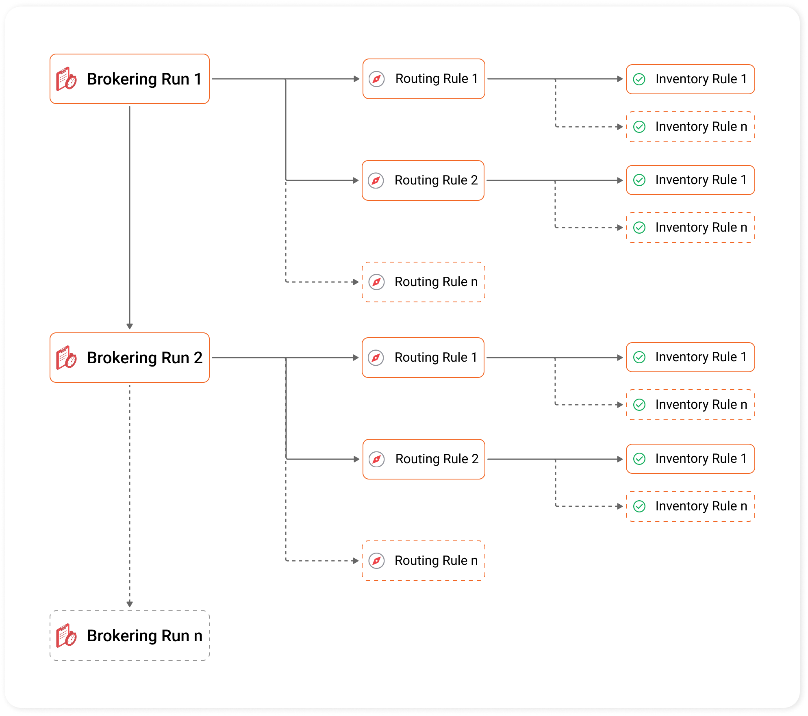

# Order Routing

## What is Order Routing?

Retailers handling multiple sales channels and fulfillment locations need sophisticated order routing. It allows each order to be fulfilled from the most optimal location, considering factors such as shipping method, proximity to the customer, inventory levels, fulfillment capabilities, and the option to split orders across locations. Effective order routing helps retailers achieve faster delivery times, reduce shipping costs, and maintain balanced inventory across all locations.

## What is Configurable Order Routing?

Configurable order routing takes traditional routing a step further by allowing retailers to customize and fine-tune order routing across their fulfillment network. Instead of depending on a fixed set of rules, configurable routing uses a brokering algorithm that evaluates orders and fulfillment options against a series of sequential rule sets, each with specific conditions.

This high level of customization enables retailers to create order routing that aligns with their unique business needs, and adjust routing parameters in real time without requiring external support. Retailers can optimize factors such as fulfillment costs, inventory distribution, and workload across locations, offering a strategic approach to order management. For scenarios where an order doesn’t meet the criteria of any rule set, configurable routing allows retailers to define specific actions to manage all unfillable orders, making sure no order is left unresolved.

This dynamic approach to order routing also lets retailers quickly adapt to evolving market conditions and customer expectations.

## Configurable Order Routing App

HotWax Commerce's highly dynamic and configurable `Order Routing App` provides a structured framework for managing order routing with flexibility. The app enables retailers to define how orders are routed across their fulfillment network.

Below is a brief overview of the brokering framework, we will understand each component in more detail in the following sections.

Order routing is organized into three hierarchical levels:

<figure><figcaption>
Brokering Framework in HotWax Commerce
</figcaption></figure>

* [x] [<mark style="color:orange;">**Brokering Runs**</mark>](brokeringruns.md)

A <mark style="color:orange;">**brokering run**</mark> is the highest level of organization in order routing and lets retailers control the routing frequency based on business needs. Each brokering run can have a different frequency, routing different batches of orders to meet varying fulfillment priorities. For example:

* A brokering run scheduled **every 5 minutes** could prioritize high-priority orders, like same-day deliveries for fast routing and fulfillment.
* For standard delivery orders with medium priority, a separate brokering run can be set to run **every 6 hours,** aligning with less urgent timelines.

<!---->

* [x] [<mark style="color:orange;">**Routing Rules**</mark>](routings.md)

Within each brokering run, there are multiple <mark style="color:orange;">**routings**</mark><mark style="color:orange;">,</mark> <mark style="color:orange;">**or**</mark> <mark style="color:orange;">**“routing rules.”**</mark> Each routing defines a batch of orders by using filters and sorting criteria. For example, in a "High-Priority Run," routings might include:

* **Same-day delivery batch**: Includes orders that need same-day delivery.
* **Next-day delivery batch**: Includes orders on next-day delivery.
* **Two-day delivery batch**: Includes orders on two-day delivery.

These routing rules help retailers prioritize routing for specific order batches with different fulfillment timelines and conditions.

* [x] [<mark style="color:orange;">**Inventory Rules**</mark>](rules.md)

Within each routing, multiple <mark style="color:orange;">**inventory rules**</mark> define how inventory is allocated to the order batches. These rules allows for optimal facility look up based on factors such as proximity, stock availability, and other strategic criteria. For example:

* **Same-day delivery batch**_**:**_ Inventory rules can prioritize fulfillment from warehouses within a 100-mile radius of the customer to meet same-day delivery targets. If inventory is unavailable, a secondary rule could expand the range to 250 miles and include stores.
* **Next-day delivery batch**: For next-day orders, inventory rules can prioritize fulfillment from warehouses within a 250-mile range, accommodating the one-day delivery SLA. Next inventory rules in sequence can apply if the first inventory rule doesn’t allocate inventory for all orders in the batch.

In the following sections, we’ll dive deeper into each level, to understand how brokering runs, routing rules, and inventory rules work together to optimize order routing.
