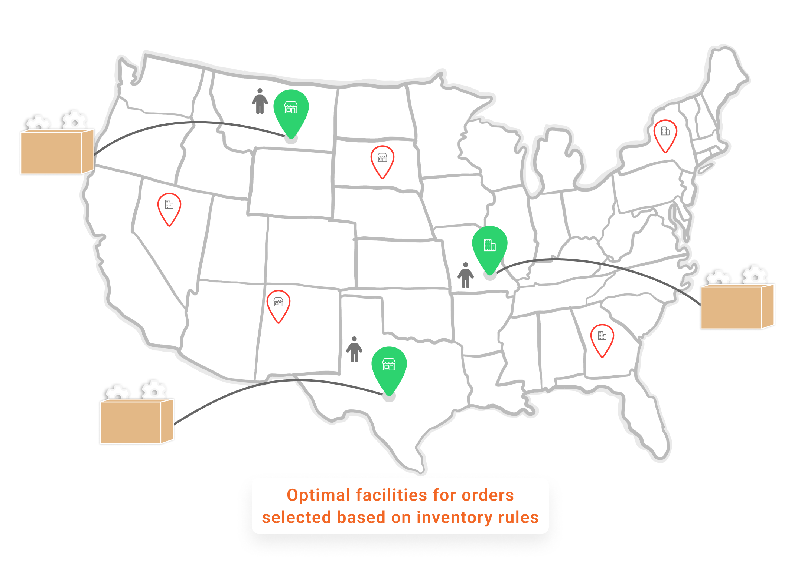
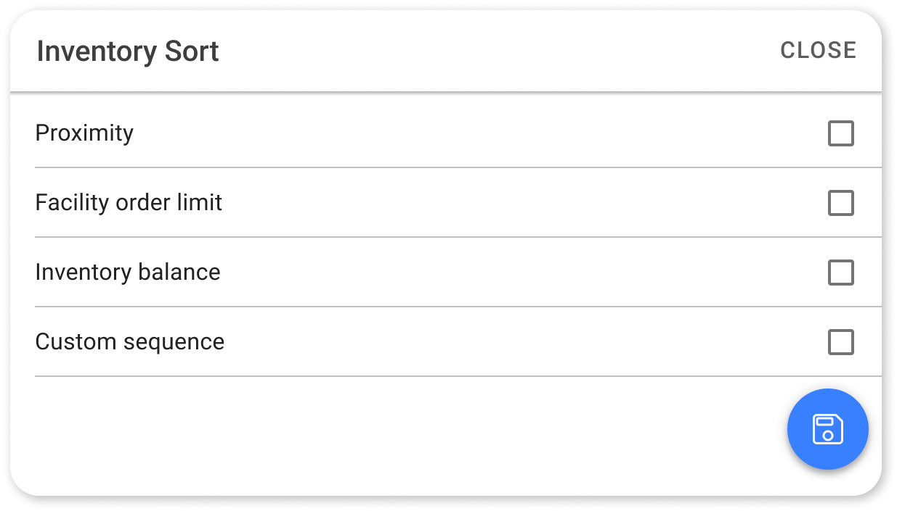

# Inventory Rules

As discussed, <mark style="color:orange;">**inventory rules**</mark> help orchestrate the process of choosing the most suitable fulfillment locations for each order in a batch of orders based on defined criteria like proximity, stock levels, and strategic priorities. These rules act as sequential steps in the order routing, guiding the brokering engine through multiple checks to find the best fulfillment location.

## Why Use Multiple Inventory Rules?

Multiple inventory rules are required because a single rule may not allocate inventory to all orders in a batch. If the first rule does not allocate inventory to some orders, the brokering engine will proceed to the next rule in sequence. This multi-step process continues through each rule until all possible options are exhausted.

Using multiple inventory rules means that if primary locations lack the required inventory, secondary locations can be considered. This layered approach increases the likelihood of successful allocation by exploring various fulfillment options.

For example, let’s continue with our example of **Same-day/Next-day batch**, assuming there are 1,500 orders:

* [x] The first inventory rule allocates inventory to 800 orders.
* [x] The second inventory rule allocates 350 more orders.
* [x] The third inventory rule allocates an additional 190 orders.
* [x] The fourth inventory rule handles another 150 orders.
* [x] Finally, the fifth inventory rule allocates 8 more orders using partial allocation.

Only 2 orders remain unfillable, moving to `Unfillable Parking` (configurable action) for rerouting as inventory becomes available.

Applying these inventory rules progressively increases the likelihood of fulfilling each order without delay by prioritizing the most optimal locations first and expanding options only when needed.

In the next sections, we will learn how to create these multiple inventory rules for different order batches.

## Creating and Managing Multiple Inventory Rules

Here’s how multiple inventory rules work within each routing rule:

* Each rule is checked in sequence. If a rule does not allocate inventory to an order, the brokering engine attempts inventory allocation using the next rule.
* If no inventory is allocated after all the rules are checked, an auto-cancellation date can be applied or the order may be moved to a different queue for reattempted routing later with a different strategy.


You can easily drag and drop inventory rules to reorder them. The order in which the rules are arranged is important, as the first inventory rule is always evaluated first, followed by the next one. This allows for flexibility in adjusting the sequence as per changing requirements.


In this section, we’ll demonstrate how to set up multiple inventory rules for two routing rules we created earlier: <mark style="color:orange;">**Same-day/Next-day orders**</mark> and <mark style="color:orange;">**Standard orders.**</mark>

<mark style="color:orange;">**Creating inventory rules is a three-step process:**</mark>

<table data-view="cards"><thead><tr><th></th><th></th><th></th></tr></thead><tbody><tr><td><ol><li><mark style="color:orange;"><strong>Filters</strong></mark></li></ol>
Look up eligible facilities with inventory that can fulfill an order.
</td><td></td><td></td></tr><tr><td><ol start="2"><li><mark style="color:orange;"><strong>Sorting</strong></mark></li></ol>
Determine which eligible facility should be prioritized to allocate an order.
</td><td></td><td></td></tr><tr><td><ol start="3"><li><mark style="color:orange;"><strong>Actions</strong></mark></li></ol>
Define fallback actions for orders that cannot be fully allocated to a single facility. The actions also help configure the final steps if all previous rules don’t allocate inventory to orders.
</td><td></td><td></td></tr></tbody></table>

<figure><figcaption>
Choose Optimal Facilties
</figcaption></figure>

### Step 1: Finding Facilities with Inventory Using Filters

The first step is to filter the available facilities to identify those capable of fulfilling an order, so the brokering algorithm considers only facilities that meet the specific criteria set by retailers for order fulfillment.

For example, a retailer may want to use both stores and warehouses for high-priority orders, such as same-day and next-day deliveries. While, for standard orders, they may prefer to rely only on warehouses, avoiding the use of stores. These preferences can be configured using inventory rules to address these types of cases effectively.

**Now, if you are wondering how to achieve this configuration, here’s how:**

Retailers can set up facility groups in HotWax’s `Facility App`. Creating facility groups is an important concept because it allows you to group different facilities. For example, in the scenario above, you could create facility groups where one group includes both stores and warehouses, while another includes only warehouses. This setup provides control over facility lookup based on order type and urgency. Here’s a user manual to understand more about the [app and its use cases.](https://docs.hotwax.co/documents/system-admins/administration/facilities/add-new-facilities)

<mark style="color:orange;">**HotWax Commerce offers several inventory filters to fine-tune which facilities are eligible for allocation, including:**</mark>

<figure><figcaption>
Inventory Filters
</figcaption></figure>

* **Turn off the facility order limit check:** Retailers can set[ fulfillment capacity](https://docs.hotwax.co/documents/system-admins/administration/facilities/configure-fulfillment-capacity) in HotWax, allowing them to define the maximum number of orders a facility can fulfill in a day. Disabling the facility order limit filter gives retailers the flexibility to bypass the defined order limit for a facility, which is especially useful during peak times or high-demand periods. For example, if a retailer turns off this limit, orders can continue to be assigned to that facility even after its maximum capacity has been reached.
* **Brokering safety stock:** Different from online ATP safety stock, [brokering safety stock](https://docs.hotwax.co/documents/retail-operations/orders/brokering/scenarios) defines the minimum stock required for an order to be brokered to a facility. For example, if a retailer sets a brokering safety stock level of 10 units, only facilities with at least 10 units of the item in stock will be eligible to fulfill the order. This prevents over-allocation and maintains safety stock levels for unforeseen demand.
* **Facility Group:** Custom grouping of locations. Grouping certain facilities allows retailers to simplify their decision-making. For example, as discussed above, there can be a dedicated facility group of only warehouses, one group can have both stores and warehouses or there can also be slow-moving or lower-demand facilities can be grouped together and allotted for non-urgent orders, while high-demand facilities are reserved for time-sensitive fulfillment.
* **Proximity:** The distance between a fulfillment facility and the customer’s address. When a facility address is added in HotWax, its latitude and longitude are automatically saved. Similarly, HotWax saves the latitude and longitude for customer addresses as well. With both locations’ coordinates stored, the brokering engine can compare them to identify warehouses and stores within the defined proximity that have available inventory. For example, a retailer can set a 200-mile proximity limit for next-day delivery orders, so only inventory within 200 miles of the customer’s address is considered. This approach supports faster, cost-effective delivery while meeting SLA requirements.


All facilities enabled for online fulfillment will be attempted for brokering if no filter is applied.


Continuing our example, let's first create inventory rules for <mark style="color:orange;">**Same-day/Next-day**</mark> orders routing.

<mark style="color:orange;">**Applying filters to look up facilities with inventory:**</mark>


First Inventory Rule Filters


1. Start Creating the Inventory Rule, click the `Add Inventory Rule` button. Name the rule, such as <mark style="color:orange;">**“Check all warehouses in 100 miles,”**</mark> to reflect its purpose of checking only the closest warehouses that can meet the same-day or next-day delivery SLA.
2. Click `Save` to save the rule name.
3. Configure filters, select the right filters to narrow down eligible facilities. For the <mark style="color:orange;">**“Same-day/Next-day orders” routing rule**</mark><mark style="color:orange;">,</mark> we will choose <mark style="color:orange;">**“Facility Group**</mark><mark style="color:orange;">”</mark> and <mark style="color:orange;">**“Proximity”**</mark><mark style="color:orange;">.</mark>

* **Facility Group:** Select <mark style="color:orange;">**“Warehouses”**</mark> from the dropdown. This limits eligibility to only warehouses with available inventory. **Why did we choose warehouse locations?** Warehouses handle larger inventory volumes and can better support online order fulfillment compared to stores, which often focus on walk-in customers.
*   **Proximity:** Set the distance to **100 miles**, so the rule includes only those warehouses within a 100-mile radius of the customer’s location.

    This means that only nearby warehouses are considered, optimizing delivery speed and meeting SLA requirements.

If no warehouse within 100 miles has inventory available, the next inventory rule expands the search to include both stores and warehouses. This multi-step approach allows the brokering engine to consider optimal warehouse locations first before evaluating stores, maximizing efficiency.

### Step 2: Sequencing Eligible Facilities Using Sorting

Once the eligible facilities are filtered, the next step is to set up sorting criteria to prioritize these locations based on specific requirements. Sorting determines the sequence in which the brokering engine evaluates facilities. For example, if 10 facilities meet the filtering criteria, sorting enables the brokering engine to choose the most optimal one based on your fulfillment goals, such as faster delivery, balanced workload, or efficient inventory usage.

<mark style="color:orange;">**Here are the available sorting options:**</mark>

<figure><figcaption>
Inventory Sorting
</figcaption></figure>

* **Proximity:** Retailers can sort inventory allocation based on the distance between the customer's shipping address and the facility. This sorting method prioritizes inventory located closer to the customer, helping reduce shipping times and costs, especially for expedited orders or those requiring same-day or next-day delivery.
* **Facility order limit:** To maintain a balanced workload at facilities, they can also be sorted based on the remaining fulfillment capacity.
  
* **Inventory balance:** Orders can be routed to facilities with the highest available stock of the ordered item, prioritizing locations with excess inventory. This strategy promotes efficient stock rotation, reduces the risk of overstocking, and helps prevent stockouts at key locations.
* **Custom sequence:** Allows full manual override to the sequence at which facilities are attempted. Retailers can set a custom sequence of facilities, defining a specific order in which locations should be considered for order routing. For example, if a retailer wants to prioritize fulfillment from underperforming stores with lower foot traffic, they can create a custom sequence that favors those stores, helping to balance inventory across all locations. Custom sequences can also be useful for managing seasonal inventory or routing orders to specific regions.


Facilities will be sorted based on creation date if no sorting preferences are applied.


<mark style="color:orange;">**Choosing sorting options to select the most optimal facility:**</mark>


First Inventory Rule Sorting


Navigate to the sort option. Continuing our example, for the <mark style="color:orange;">**“Check all warehouses in 100 miles”**</mark> inventory rule, we’ll use the <mark style="color:orange;">**"Proximity"**</mark> sorting option.

This sorting option will arrange eligible facilities within the 100-mile range by their distance from the customer, so the closest warehouse is chosen for fulfillment. This approach supports meeting same-day or next-day delivery requirements by minimizing transit time.

### Step 3: After Actions Logic

After applying filters and sorting, the final step is to define the actions to take if some orders in a batch do not receive inventory.

Once filters and sorting have been defined, the brokering engine identifies the optimal facility to allocate inventory for orders. Multiple inventory rules are created so that if the first rule fails to allocate inventory to some orders, the next rule can be tried. In this scenario, specifying the action <mark style="color:orange;">**“move items to next rule”**</mark> allows the brokering engine to check the next rule for unavailable items.

There may also be cases where, when the brokering engine tries to allocate inventory to an order, inventory for some items is available while for others it is not, or if available, it may be at different locations. In such cases, we can specify actions to **allow or disallow partial allocation**. This action serves as one of the final attempts to allocate inventory to orders, ideally included in the last inventory rule.

After-action logic helps manage orders accurately, whether through partial fulfillment or rerouting at a later time, by moving unfillable orders to a different queue.

<mark style="color:orange;">**Here are the available actions:**</mark>

1. **Partially available**

* **Allow partial allocation:** Allow an order to be split and allocated partially if some items are available at a location. For example, a same-day/next-day batch may allow partial allocation in the final inventory rule, while standard orders may prohibit partial allocation across all rules. While partial allocation enables some items to be fulfilled immediately, it can increase shipping costs. To mitigate this, retailers can enable the **Brokering Shipment Threshold** in HotWax, which only allows order splitting if the order’s value exceeds a minimum threshold. Learn more about [Brokering Shipment Threshold](https://docs.hotwax.co/documents/retail-operations/orders/brokering/scenarios) and how to implement it.
* **Partially allocate grouped items:** Allow orders containing kits or gift items to be split and allocated partially if some items are available. If you want to allow splitting for other items but wish to [prevent splitting for grouped items](https://docs.hotwax.co/documents/retail-operations/orders/brokering/scenarios), you can configure this by toggling **ON** partial allocation and toggling **OFF** partial allocation for grouped items.

2. **Unavailable items**

* **Move items to queue:** Transfer unallocated order items to the selected queue for further processing. When inventory couldn’t be allocated to an order but further allocation attempts should not be made, the order can be moved to a specific queue. This allows for holding such unfillable orders until the appropriate action can be taken. For example, unfillable orders can be moved to the `Unfillable Parking`**,** where they can later be rerouted through a different routing strategy. Ideally, this should be part of your final inventory rule.
* **Next rule:** Automatically move unallocated order items to the <mark style="color:orange;">**next inventory rule**</mark> in the sequence. When using multiple rules, this is the **default action**, allowing the brokering engine to attempt inventory allocation through each rule in sequence.
* **Auto cancel days:** Specify the number of days to automatically cancel orders that could not be allocated. Based on inventory availability, retailers may want to set an auto-cancel date for orders to prevent them from staying in the fulfillment pipeline for too long. Ideally, this should be part of the final inventory rule.
* **Clear auto cancel days:** This option is helpful when an auto-cancel date has been applied to an order, but incoming inventory is expected to fulfill it. For example, if unfillable items were moved to an `Unfillable Parking`with an auto-cancel date, and inventory is now expected to arrive, clearing the auto-cancellation date during routing can prevent automatic cancellation. This allows the brokering engine to reroute the order once inventory arrives, maximizing fulfillment opportunities. It's also important to note that applying or clearing an auto-cancel date will apply to all unfillable orders. If there’s an exception and you want to perform an action for a single order only, you should do so directly in HotWax OMS. You can move the specific order to a new queue, like `Unfillable Hold Parking`, and then remove its auto-cancel date.

<mark style="color:orange;">**Deciding actions to choose the most optimal facility:**</mark>


First Inventory Rule Actions


1. In Actions, navigate to the partially available card. Continuing our example, for the <mark style="color:orange;">**“Check all warehouses in 100 miles”**</mark> inventory rule, we’ll keep the **Partial fulfillment as disabled** because we want to try allocating inventory to orders using multiple rules without splitting an order. We can allow splitting in our final inventory rule.
2. Navigate to unavailable items card. Here we will set the action as <mark style="color:orange;">**“Move unavailable items”**</mark> to the <mark style="color:orange;">**“Next Rule.”**</mark> This means that the brokering engine will now try to allocate inventory using the next configured inventory rule in our sequence. We don’t want to apply an auto cancel date yet or move unfillable items to a separate queue. We can do this in our final rule.


By default partial fulfillment is disabled and move items to next rule is selected in actions.


Great! With your first inventory rule in place, creating additional inventory rules will expand the facility lookup and optimize inventory allocation for same-day and next-day orders.

### Configuring Additional Inventory Rules for Same-Day and Next-Day Orders


The following examples provide a brief overview of potential inventory rules, which may vary depending on a business’s unique priorities and requirements.


To add more inventory rules, follow these steps:

* Click on the `Add Inventory Rule` button and give the new rule a distinct name, such as <mark style="color:orange;">**“Check all locations in 100 miles,”**</mark> to reflect its purpose of checking both the stores and warehouses that can meet the same-day or next-day delivery SLA.

For the **second inventory rule**, we will expand facility lookup with the **"Proximity"** Filter:


Second Inventory Rule


* Click on the `Add Inventory Rule` button and give the new rule a distinct name, such as <mark style="color:orange;">**“Check all locations in 100 miles"**</mark>**.**
* **Filter:** We will use the <mark style="color:orange;">**"Proximity"**</mark> filter, setting the distance to 100 miles. This rule expands the facility lookup to include all facilities <mark style="color:orange;">**(both stores and warehouses)**</mark> within a 100-mile radius of the customer’s location.


We are not using the Facility Group filter here to include all fulfillment locations (stores and warehouses) within the 100-mile radius.


* **Sorting:** Under sorting, we will choose proximity so that the closest facility with the available inventory is selected.
* **Action:** For any items in this batch that remain unfillable, we will set the action as <mark style="color:orange;">**“Move unavailable items”**</mark> to the <mark style="color:orange;">**“Next Rule.”**</mark>

For the **third inventory rule**, we will further expand facility Lookup with **"Proximity**" Filter:


Third Inventory Rule


* Click on the `Add Inventory Rule` button and give the new rule a distinct name, such as <mark style="color:orange;">**“Check all locations in 250 miles".**</mark>
* **Filter:** We will use the <mark style="color:orange;">**Proximity**</mark> filter, setting the distance to 250 miles. This rule expands the facility lookup to include all facilities (both stores and warehouses) within a 250-mile radius of the customer’s location.
* **Sorting:** Again, we will use the <mark style="color:orange;">**Proximity**</mark> option to choose the closest facility with available inventory.
* **Action:** For any items in this batch that remain unfillable, we will set the action as <mark style="color:orange;">**“Move unavailable items”**</mark> to the <mark style="color:orange;">**“Next Rule.”**</mark>

For the **fourth inventory rule**, we will further expand facility lookup without any distance limitation:


Fourth Inventory Rule


* Click on the `Add Inventory Rule` button and give the new rule a distinct name, such as <mark style="color:orange;">**“Check all locations".**</mark>
* **Filter:** We <mark style="color:orange;">**will not apply any filter**</mark>, allowing the brokering engine to consider all facilities, regardless of distance. This rule allows every facility (store or warehouse) to be considered for fulfilling unallocated orders.
* **Sorting:** We will sort facilities by <mark style="color:orange;">**"Proximity"**</mark>, so the closest location is selected.
* **Action:** For any items in this batch that still remain unfillable, we will set the action as <mark style="color:orange;">**“Move unavailable items”**</mark> to the <mark style="color:orange;">**“Next Rule.”**</mark>

For the final **fifth inventory rule**, we will again include all facilities but also enable order splitting to allow partial fulfillment across different facilities.


Final inventory rule


* Click on the `Add Inventory Rule` button and give the new rule a distinct name, such as <mark style="color:orange;">**“Check all locations, allow splitting".**</mark>
* **Filter:** We <mark style="color:orange;">**will not apply any filter**</mark>, allowing the brokering engine to consider all facilities, regardless of distance.
* **Sorting:** We will sort facilities by <mark style="color:orange;">"</mark><mark style="color:orange;">**Proximity"**</mark>, so the closest location is selected.
* **Action:** We will <mark style="color:orange;">**toggle ON “Partial allocation”**</mark> to enable partial allocation across multiple facilities if inventory is spread out. For items in this batch that still remain unfillable after we have applied multiple rules, we will set the final action as <mark style="color:orange;">**“Move unavailable items”**</mark> to the <mark style="color:orange;">**“Queue,”**</mark> and select `Unfillable Parking` from the dropdown. We will also apply a <mark style="color:orange;">"</mark><mark style="color:orange;">**7 days auto-cancel date"**</mark> for these unfillable orders.


Once you've configured each rule, change its status from **Draft** to **Active** to make it operational. To do this, click on **Draft** and select **Active,** or revert an active rule back to **Draft** if any adjustments are required.

Once all rules are active, and your routing is fully configured, set the [Brokering Run](brokeringruns.md) to **Active** so that orders can be processed as scheduled.


### Add Special Handling for Standard Orders

For standard orders with a longer SLA (7 days or more), inventory rules can be configured differently to prioritize fulfillment from warehouse locations, reserving in-store stock for higher-priority, faster-shipping orders. Here’s how to create inventory rules for “Standard orders” routing:

* Navigate to the `Brokering Run` details page, choose the <mark style="color:orange;">**Standard orders**</mark> routing, and follow the steps below to add inventory rules.
* Click on the `Add Inventory Rule` button and give the new rule a distinct name, such as <mark style="color:orange;">**“Check all warehouses in 250 miles,”**</mark> to reflect its purpose of checking only warehouse locations in the defined proximity.




Standard Orders First Inventory Rule





Standard Orders Second Inventory Rule





Standard Orders Final Inventory Rule




For the **first inventory rule**, we will prioritize warehouse locations with most inventory.

* **Filter:** We will choose <mark style="color:orange;">**“Warehouses”**</mark> in the <mark style="color:orange;">**“Facility group”**</mark>**,** excluding stores to maintain inventory levels for faster-shipping orders. We will also use the Proximity filter, setting the distance to 250 miles. This rule expands the facility lookup to include all warehouses within a 250-mile radius of the customer’s location, allowing us to reduce shipping costs if a nearby warehouse is available.
* **Sorting:** We will choose <mark style="color:orange;">**“Inventory balance”**</mark> to route orders to warehouses with the highest available inventory. Proximity sorting isn’t prioritized here, as the goal is to maximize inventory balance within 250 miles.
* **Action:** For any items that remain unfillable, we will set the action to <mark style="color:orange;">**“Move unavailable items”**</mark> to the <mark style="color:orange;">**“Next Rule.”**</mark>

For the **second inventory rule**, we will prioritize warehouse locations with most inventory.

* Click on the `Add Inventory Rule` button and give the new rule a distinct name, such as <mark style="color:orange;">**“Check all warehouses in 500 miles".**</mark>
* **Filter:** We will use the **Facility Group** filter and continue to restrict the facility lookup to <mark style="color:orange;">**Warehouses**</mark> only but we will now expand the distance to **500 miles** using the Proximity filter.
* **Sorting:** We will again choose <mark style="color:orange;">**“Inventory balance”**</mark> sorting to select the optimal warehouse in 500 miles with the available inventory.
* **Action:** If any items still remain unfillable, we will set the action to <mark style="color:orange;">**“Move unavailable items”**</mark> to the <mark style="color:orange;">**“Next Rule.”**</mark>

For the final **third inventory rule**, we will look up all warehouse locations.

* Click on the `Add Inventory Rule` button and give the new rule a distinct name, such as <mark style="color:orange;">**“Check all warehouses".**</mark>
* **Filter:** We will continue to restrict the facility lookup to <mark style="color:orange;">**Warehouses**</mark> only using the **Facility Group** filter. However, this time we will not use the Proximity filter, allowing all warehouse locations to be considered.
* **Sorting:** We will again choose <mark style="color:orange;">**“Inventory balance”**</mark> sorting to select the optimal warehouse with available stock.
* **Action:** For items in this batch that still remain unfillable after we have applied multiple inventory rules, we will set the final action as <mark style="color:orange;">**“Move unavailable items”**</mark> to the <mark style="color:orange;">**“Queue,”**</mark> and select `Unfillable Parking` from the dropdown. We will also apply a <mark style="color:orange;">**7 days auto-cancel date**</mark> for these unfillable orders.

This is how in a single brokering run, you can set up multiple routings with unique inventory rules based on each order batch specific needs.

<figure><figcaption>
Everyday Order Routing
</figcaption></figure>

**What did we do differently for standard orders?**

For <mark style="color:orange;">**Standard orders**</mark>, we focused only on **"Warehouse"** locations, **prioritized "Inventory balance" over “Proximity"** and **"Disabled partial allocation"** across all inventory rules.


When an inventory rule is no longer needed, you can simply `Archive` it by changing its status from the top right corner. You can unarchive the inventory rule if it’s needed again.


Key Takeaways

* _<mark style="color:orange;">**Brokering runs**</mark>_ determine the frequency for routing order batches.

- _<mark style="color:orange;">**Routing**</mark>_, also known as a routing rule, involves creating order batches based on filters for order lookup and sorting. It’s a flexible setup where you decide which orders should be grouped together.

* _<mark style="color:orange;">**Inventory rules**</mark>_, within each routing setup, you can define multiple inventory rules. If the first inventory rule doesn’t fully allocate inventory to an order, the brokering engine checks the next rules in sequence. Each rule helps look up facilities with the available inventory.

- _<mark style="color:orange;">**After actions logic**</mark>_, when inventory rules are applied, specific decisions need to be made based on inventory availability. For example, an item may be unavailable at a single facility, or not available at all. Handling these cases may involve using options like order splitting or moving orders to the Unfillable Queue.


By leveraging HotWax Commerce, `Order Routing App`retailers can create highly customized and efficient order routing strategies that optimize inventory usage, reduce shipping times and costs, and align their fulfillment process with their unique business needs.


### Next Steps

In the following sections, we’ll cover a range of business [use cases](scenarios.md) that the HotWax Commerce `Order Routing` App can help achieve, highlighting its adaptability to various inventory and order fulfillment needs.
