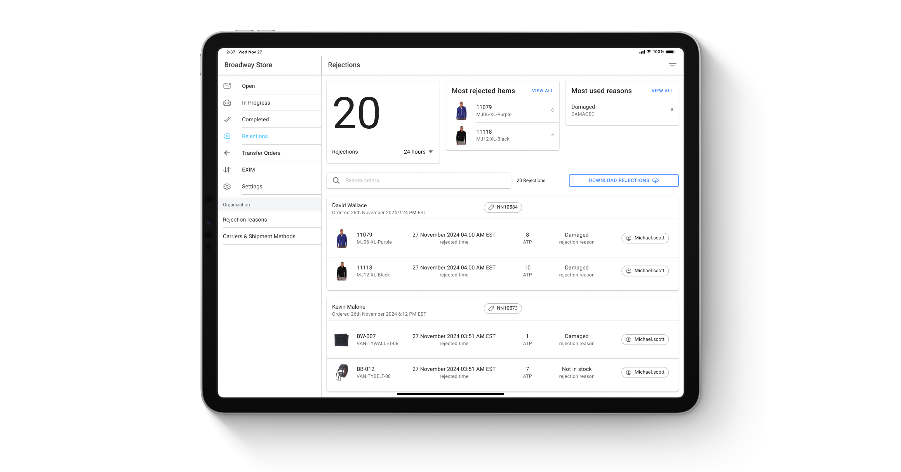
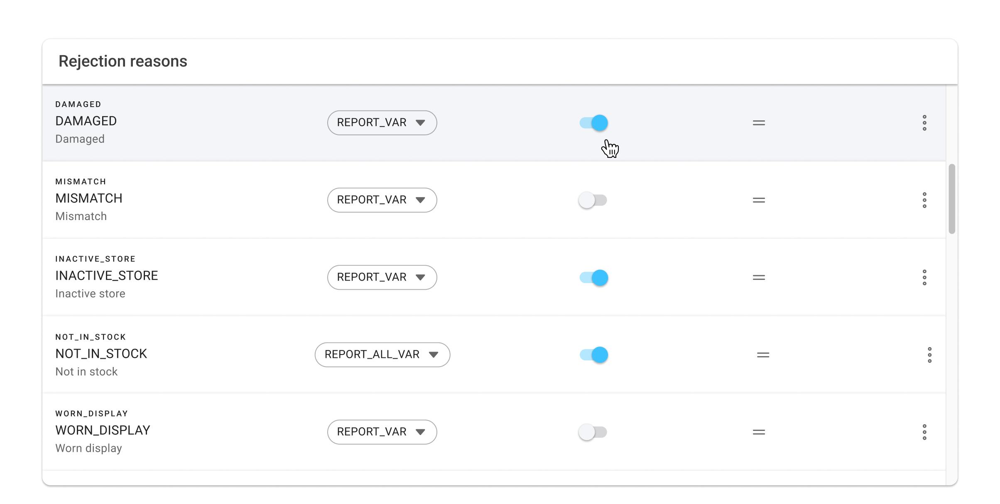

# Rejection

The Fulfillment App allows store users to reject items from an order or complete an order when it can’t be fulfilled from the current facility. Rejected orders are moved to the ‘Rejected Item Parking’, to automatically reallocate them. Ensure that at least one brokering rule addresses orders at this parking.

## Reject Single Orders

1. Go to the **In-Progress** page.
2. Search for the desired order.
3. Click the **Trash Bin** icon next to it.
4. Select an appropriate reason from the dropdown.
5. Save the changes.

The OMS will route the order to another facility based on product availability, customer shipping preferences, and routing rules.


Reject Single&#x20;


## Bulk Reject Orders

Stores may face issues with their fulfillment capabilities in some instances. When a store cannot fulfill orders for a given day, store managers with the permission of `COMMON_ADMIN` can reject all orders in bulk from the **Open** and **In Progress** order pages.

1. In the **Open** or **In Progress Orders** screens, click the **Reject All** icon at the top right corner.
2. All orders in that status will be rejected and removed from the facility.


Bulk Reject Orders



The Reject All button does not affect the inventory of the facility. To ensure that no new orders are brokered to the facility, set the **Online order fulfillment capacity** to **No Capacity**.


## Rejection Analytics

The Rejection Analytics Page provides a detailed view of order rejections, helping store associates and managers analyze trends and address inventory issues.

### Features:

* **Total Rejections:** Displays the total count of all rejected items.
* **Frequently Rejected Items:** Highlights the products most often rejected.
* **Common Rejection Reasons:** Lists common causes like out-of-stock items or damaged products.
* **All Rejected Items:** Shows a complete list of rejected order items for detailed tracking.

### Filters and Search Options:

* **Time Filters:** Analyze rejection data from the last 24 hours or 7 days.
* **Search:** Locate specific rejected items using Product SKUs or order details.
<figure><figcaption>
Rejections Analytics
</figcaption></figure>

## Rejection Reasons

Retailers can configure which rejection reasons they want to offer for their staff to choose from if they're unable to fulfill items in an order. To access this page, users must have `SFA_ADMIN` permission.

### Overview:

* **Store Associates:** In the Fulfillment App and BOPIS App, store associates see rejection reasons specific to in-store operations, such as out-of-stock items or damaged products.
* **Customer Service Representatives (CSRs):** In the Order Management System, CSRs view broader rejection reasons suited for customer interactions, such as manual reallocation.
* **Admin Users:** Admin or operations managers can view all rejection reasons across roles for complete oversight.

### Toggle for Showing Rejection Reasons:

Rejection reasons can be shown or hidden from store associates using the fulfillment app by using the toggle on the settings page.

**How It Works:**

* **When the toggle is ON:** The specific rejection reason will be visible, while all other reasons will remain hidden.
* **When the toggle is OFF:** The specific rejection reason will be hidden, but all other reasons will still be visible.
<figure><figcaption>
Rejection Reasons
</figcaption></figure>

### Rejection reason types that trigger inventory adjustments and how these types cause stock levels to be updated:

Rejection reasons in the system are divided into specific types to define how they affect inventory. Each type explains what action should be taken on the inventory when a rejection reason is applied. This helps manage inventory updates smoothly and accurately.

* **REPORT\_NO\_VAR:**\
  Rejection reasons with this type do not affect inventory.
  * Stock levels remain unchanged when these reasons are used.
* **REPORT\_VAR:**\
  Rejection reasons with this type cause inventory to be adjusted.
  * The rejected quantity is deducted from the store’s inventory, reducing stock availability for the rejected item.
* **REPORT\_ALL\_VAR:**\
  This type eliminates all remaining inventory for the rejected item.
  * It is used in scenarios where the entire stock for the item needs to be depleted.

The table below lists the default rejection reasons and their assigned types, which define how they impact inventory levels. Retailers can also create custom rejection reasons with specific types to handle unique inventory adjustments as needed.

| Rejection Reason | Type             | Action                                                                         | Purpose                                                                                                   |
| ---------------- | ---------------- | ------------------------------------------------------------------------------ | --------------------------------------------------------------------------------------------------------- |
| NOT IN STOCK     | REPORT\_ALL\_VAR | Sets ATP and QOH inventory to 0 for the rejected product.                      | Prevents new orders until the product is restocked.                                                       |
| MISMATCH         | REPORT\_VAR      | Decreases ATP and QOH inventory by the rejected quantity.                      | Indicates the product is still in stock but unavailable for orders requiring the rejected size or color.  |
| DAMAGE           | REPORT\_VAR      | Decreases ATP inventory by the rejected quantity, while QOH remains unchanged. | Shows the product is in stock but damaged and unsellable.                                                 |
| NO VARIANCE      | REPORT\_NO\_VAR  | Does not affect either ATP or QOH inventory.                                   | Useful for scenarios where inventory levels remain unchanged, e.g., canceled orders without stock issues. |

## Adjust QOH Along with ATP on Rejection

The **Adjust QOH Along with ATP on Rejection** toggle provides control over inventory adjustments during order rejections.

### Why disable impact on QOH?

The main reason to disable QOH impact from rejection reasons would be to limit the impact store associates have on your inventory record. Retailers that use HotWax Commerce’s store inventory management capabilities like Cycle Counting rely on the QOH level as a source of truth for physical inventory levels. Allowing rejections to impact QOH opens up the possibility of store staff accidentally creating massive inventory discrepancies by selecting the wrong rejection reason.

By suppressing ATP and not QOH, over-selling is still prevented and orders for those particular products won’t be routed to that store. When fulfillment administrators then review the rejections and inventory discrepancies, they are able to use the delta between the QOH and ATP to judge the validity of the store staff’s claim of inventory being unavailable.

Retailers that don’t utilize HotWax Commerce for store inventory management only need the OMS to maintain an accurate record of sellable inventory. In that case, retailers should allow rejections to impact both ATP and QOH.
<figure><figcaption>
Affect QOH on Rejection
</figcaption></figure>

## Partial Rejection

When partial rejection is enabled, individual items get rejected from a facility without impacting the rest of the order. Here’s how it works:

1. **Reject the Item:** Click the trash bin icon next to the unfulfillable item.
2. **Choose a Reason:** Select a reason for rejection, like "not in stock" or "damaged."
3. **Process Remaining Items:** The rest of the items in the order remain at the allocated facility for fulfillment and will be shipped as usual.
4. **Rebrokering:** The rejected item is sent to another facility for fulfillment.

When partial rejection is disabled, rejecting any item in an order triggers the rejection of the entire order. Here’s how this works:

1. **Reject the Item:** Click the trash bin icon next to the unfulfillable item.
2. **Choose a Reason:** Select a reason for rejection, like "not in stock" or "damaged."
3. **Automatic Rejection:** The entire order is rejected with the reason "reject entire order." This will not impact inventory variance or appear in rejection reports.

If additional items need to be rejected with a specific reason, click on the default rejection reason applied to the item and make a selection.
<figure><figcaption>
Configure Partial Rejection
</figcaption></figure>

## Collateral Rejection

Collateral rejection helps manage situations where the product in a rejected order item is part of multiple pending orders at a facility. When this is enabled, rejecting an item automatically rejects it in all other orders containing the same product. The behavior depends on whether partial rejection is allowed:

* **If partial rejection is allowed:** Only the selected item will be rejected from all related orders, and the remaining items in those orders will still be fulfilled from the original facility.
* **If partial rejection is not allowed:** All orders containing the rejected item will be completely rejected, not just the individual item.

This feature ensures faster re-routing of unfulfillable items, minimizing delays across all orders containing the same product.

<figure><figcaption>
Configure Collateral Rejection
</figcaption></figure>
