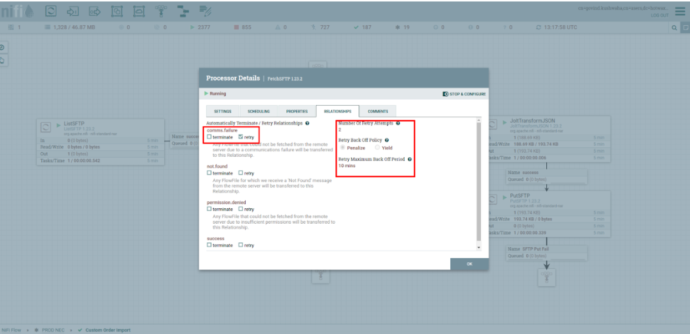
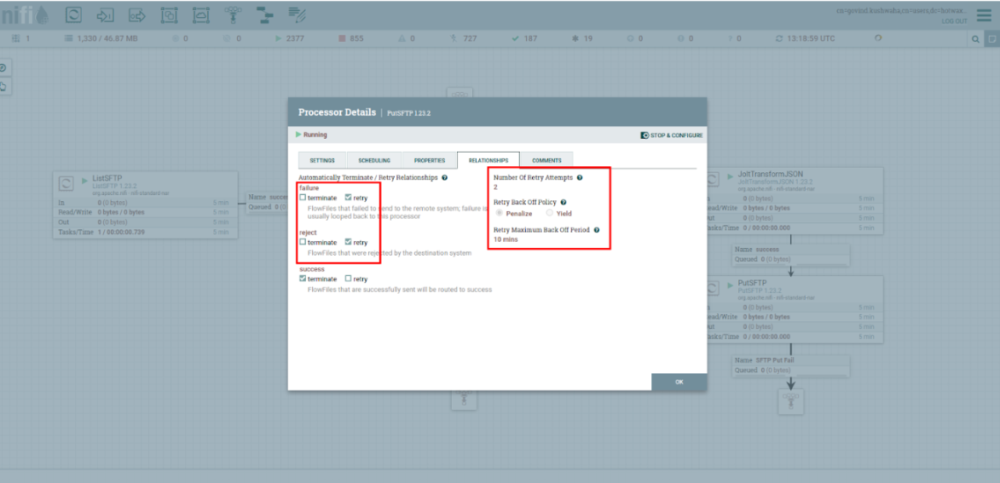
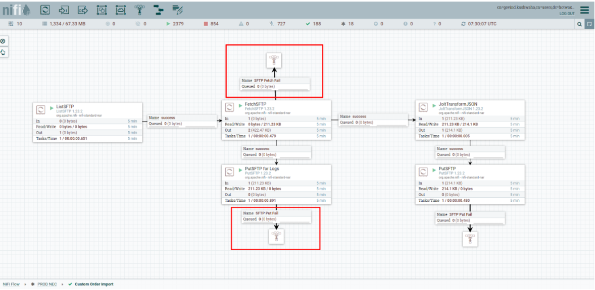
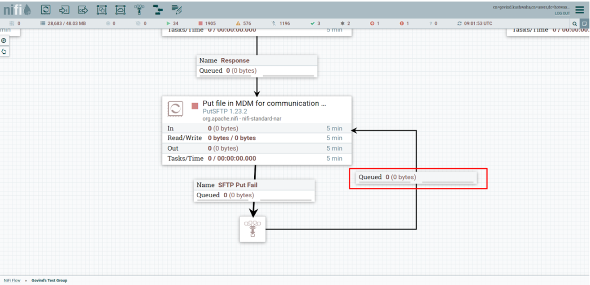
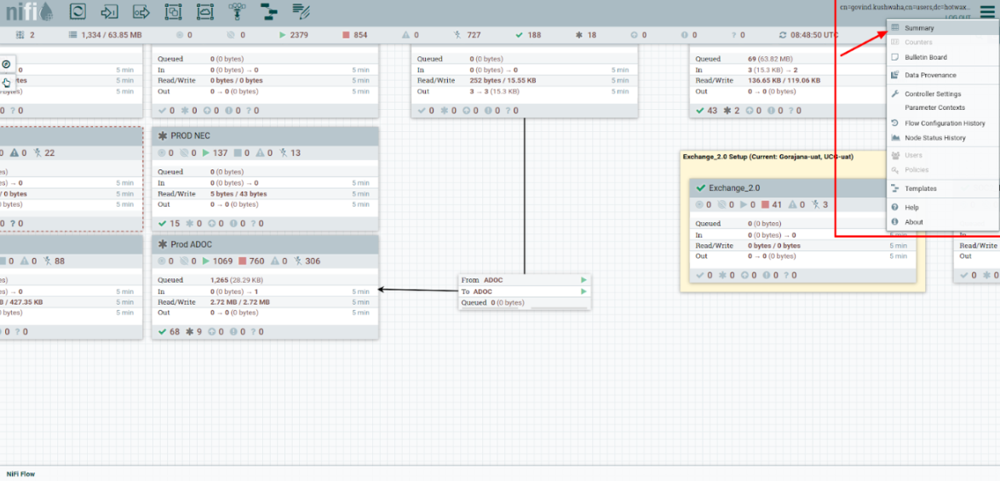
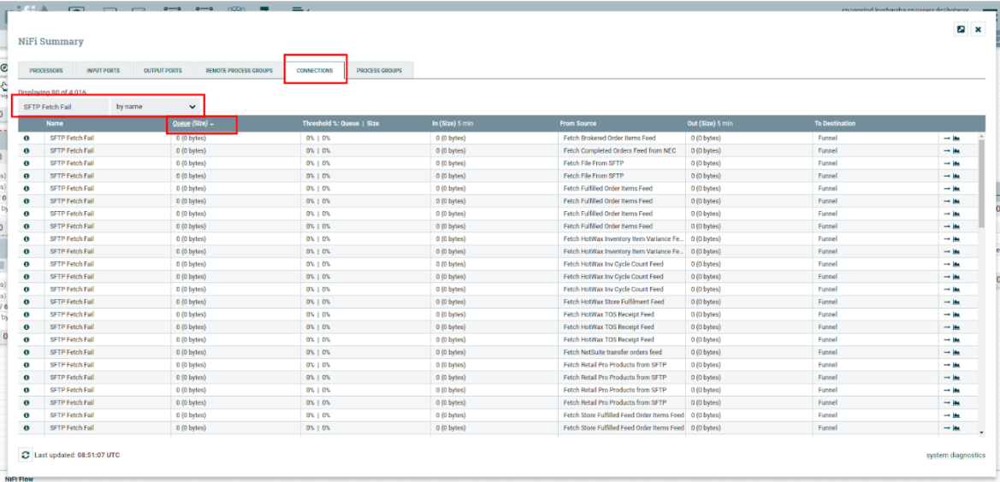

# Fetch/Put SFTP Retry Configurations

## Purpose
This SOP outlines the steps required to configure and manage SFTP Retry for Fetch SFTP and Put SFTP processors in Apache NiFi, ensuring adherence to best practices.  
**URL:** [https://napita.hotwax.io/nifi/](https://napita.hotwax.io/nifi/)

---

## Configuration for the SFTP Processor

### 1. Access the SFTP Processor
- Navigate to **Apache NiFi > Processor Group > Fetch/Put SFTP Processor**.

### 2. Configuration for Fetch SFTP Processor
- Set the `comms.failure` relationship to **Retry**. Configure the following values:
  - **Number of Retry Attempts:** 2  
  - **Retry Back Off Policy:** Penalize  
  - **Retry Back Off Duration:** 10 min (default)  
  - **Penalty Duration:** 30 sec (default)  
   
   <figure><figcaption></figcaption></figure>

#### Add a Funnel:
- Add a funnel to the Fetch SFTP Processor.
- Redirect the following relationships to the funnel:
  - `comms.failure`  
  - `permission.denied`  
  - `not.found`
- **Name the connected relationship:** `SFTP Fetch Fail`.  

 The relationship name must match exactly 

### 3. Configuration for Put SFTP Processor
- Set the **[failure, reject]** relationship to **Retry**. Configure the following values:
  - **Number of Retry Attempts:** 2  
  - **Retry Back Off Policy:** Penalize  
  - **Retry Back Off Duration:** 10 min (default)  
  - **Penalty Duration:** 30 sec (default)  

   <figure><figcaption></figcaption></figure>

#### Add a Funnel:
- Add a funnel to the Put SFTP Processor.
- Redirect the following relationships to the funnel:
  - `failure`  
  - `reject`
- **Name the connected relationship:** `SFTP Put Fail`.

 The relationship name must match exactly 

   <figure><figcaption></figcaption></figure>
---

## Resolution Steps

### When the SFTP Processor Starts Working:
#### Redirect Funnel Relationships:
1. Access the SFTP processor where the files are queued.
2. Redirect the funnel relationships (`SFTP Fetch Fail` or `SFTP Put Fail`) back to the original processor by connecting the funnel to the respective processor.  
   - This will create a loop to re-run the failures.
3. Process all the queued files.
4. Perform this action for both the Fetch and Put SFTP processors as applicable
   <figure><figcaption></figcaption></figure>


Once the queue has been processed and cleared, **remove the connection** between the funnel and the original processor to prevent an infinite loop in case of future failures.


#### Validate:
- Ensure the queued files are correctly processed after redirection.

---

## Monitoring and Verification

### 1. Check Queued Files for Clients
#### Navigate to Summary:
- Click on the **hamburger icon** in NiFi's main navigation bar.  
- Select **Summary**.
<figure><figcaption></figcaption></figure>

#### Open the Summary Window:
- A new pop-up window titled **"NiFi Summary"** will appear.  
- Go to the **Connections** tab.

#### Locate Relationships:
- Search for the relationships **"SFTP Fetch Fail"** or **"SFTP Put Fail"** in the list.  
- Select **By Name**.  
- Sort the **Queue (Size)** column in descending order by clicking the column header.

<figure><figcaption></figcaption></figure>

#### Redirect to Processor:
- Click on the **Arrow Icon** corresponding to the desired relationship to directly navigate to the associated processor.

<figure><figcaption></figcaption></figure>

- Review the queued files for the processor and follow the resolution steps mentioned above to ensure proper processing.

---

## Key Notes

### Consistency:
- Ensure all relationship names and funnel configurations strictly adhere to the specified formats:  
  - **SFTP Fetch Fail**  
  - **SFTP Put Fail**

### Regular Monitoring:
- Check for queued files periodically to prevent bottlenecks in data flow.
